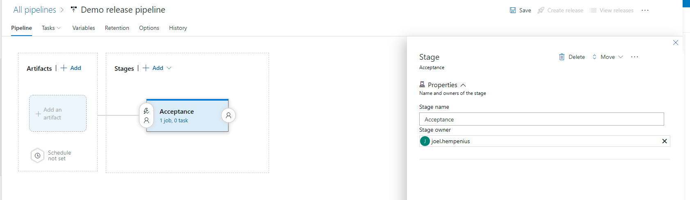
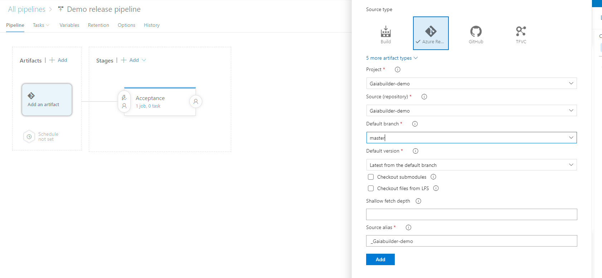
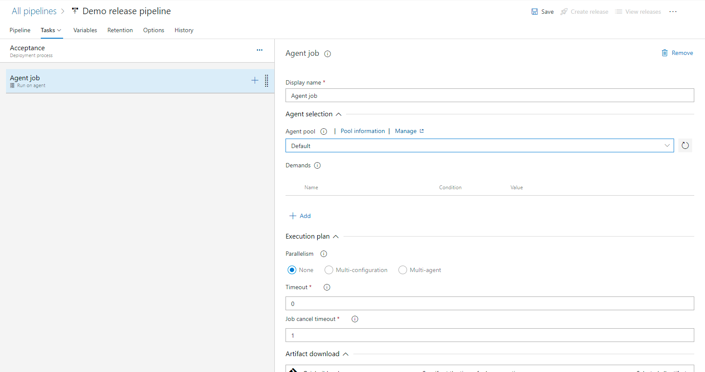
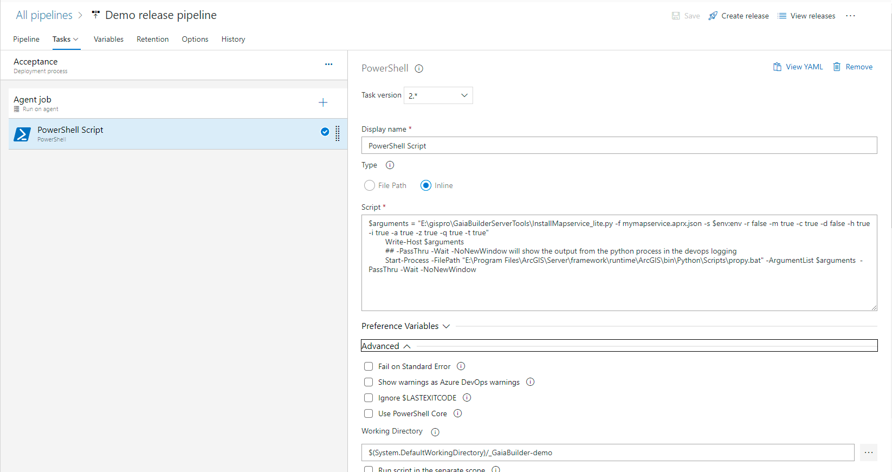
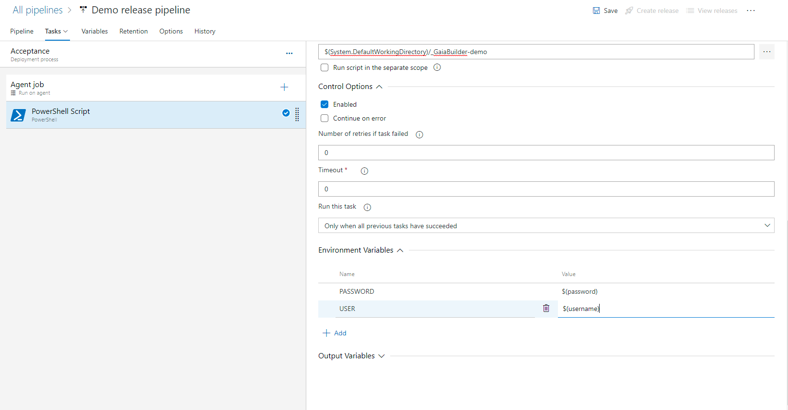
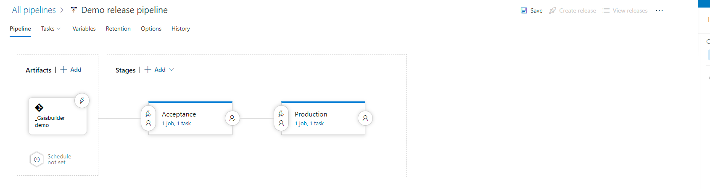
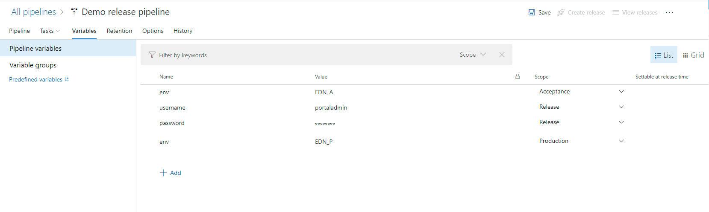

# Azure 
The azure pipelines can be created from the templates. Change the following items in the pipeline to make it work with your Azure Devops
- trigger : none or the branch or branches as list. A push trigger specifies which branches cause a continuous integration build to run.
- pool -> name: the agent pool you want to use for the build, this should match the agent which is installed with ArcGIS Server or ArcGIS Pro
- script: update the directories for the ArcGIS Server Python, the GaiaBuilder Directory , the file you want to deploy and the environment it should be deployed to
- env -> USER: the Portal build-in user you want to use for authentication in the build
- env -> PASSWORD: the password variable as secret configured on your pipeline, store the password as a secret in the pipeline to avoid storing the password in the repository.

# Configuring a release pipeline
A build pipeline in for Azure Devops can be found in the templates. However, a release pipeline isn't a yaml file in the repository and therefore it is shared as a basic instruction
- Create a new release pipeline. Rename the first to the environment your release pipeline will deploy first:


- Add an artifact, this will be the git repository where your maps and content are stored. In this example, the master branch is checked out. Take a note of the source alias, you will need it in the coming steps

- Configure the agent job to use the Agent Pool where the GaiaBuilder build scripts are installed, in this example 'Default'

- Add a Powershell script step to the agent. The script could look like this. Change the paths where necessary to point to your propy.bat installation and the GaiaBuilder scripts installation. $env:env will insert the ArcGIS Enterprise environment into the arguments at run time from the Pipeline variables
```$arguments = "E:\gispro\GaiaBuilderServerTools\InstallMapservice_lite.py -f public_transport.aprx.json -s $env:env -r false -m true -c true -d false -h true -i true -a true -z true -q true -t true"
        Write-Host $arguments
        ## -PassThru -Wait -NoNewWindow will show the output from the python process in the devops logging
        Start-Process -FilePath "E:\Program Files\ArcGIS\Server\framework\runtime\ArcGIS\bin\Python\Scripts\propy.bat" -ArgumentList $arguments  -PassThru -Wait -NoNewWindow
```
Set the working directory under Advanced, $(System.DefaultWorkingDirectory)/_YOUR_SOURCE_ALIAS_

- Configure the environment variables to set the Portal for ArcGIS Username and Password. The names must be USER and PASSWORD, the values will be the pipeline variables which will be configured in the next steps.

- Duplicate the Stage using the + button and rename the stage to the next environment

- Go to variables and create the necessary variables. For this example you will need 'env', 'username' and 'password', don't forget to make the password variable a secret. You can assign a variable for the whole release pipeline, or duplicate them and make them specific for a Stage. In this example, the env variable is duplicated, which means th Acceptance Stage will deploy to the EDN_A ArcGIS Enterprise environment and the Production Stage will deploy to the EDN_P ArcGIS Enterprise environment.

- A post deployment condition can be added after each stage. This will pause the release pipeline until approval is given or stop the pipeline when a release is rejected. This gives the opportunity to do a manual test of the release at that stage and environment.
[[create_release_pipeline_7.png]]
