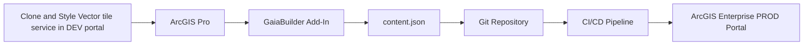
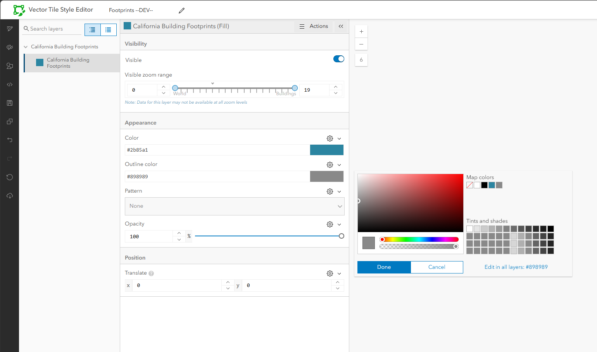
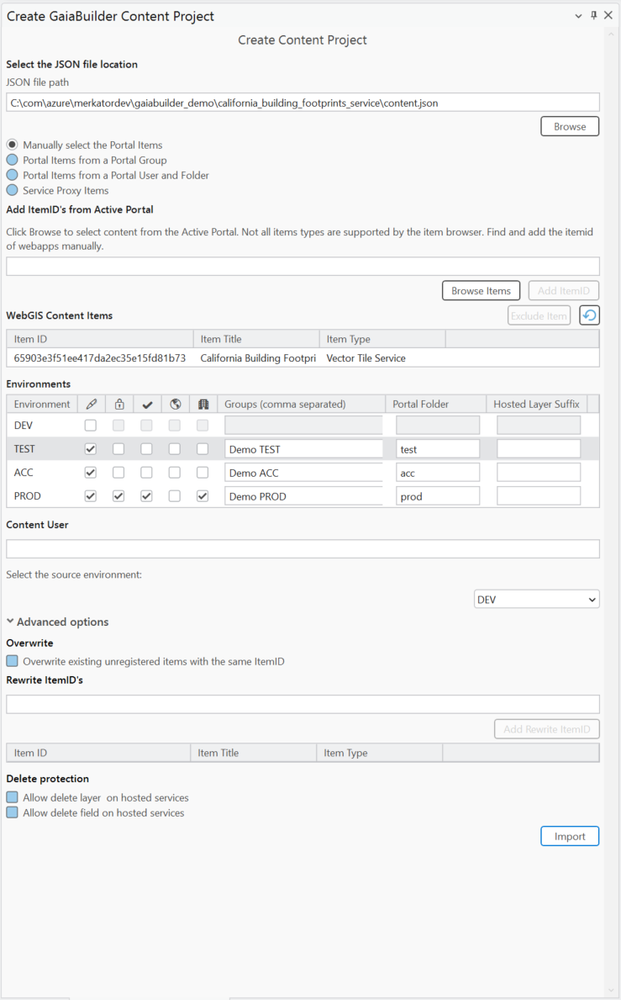

# Copying and Styling Vector Tile Layers

In this example we demonstrate the publishing and sharing of a vector tile service in a virtual DTAP environment in ArcGIS Enterprise.

## Prerequisites

### 🧠 Assumptions

You should be familiar with:

* High level knowledge of GaiaBuilder to manage deployments through JSON
* Use source code management systems like Git, Subversion or Bitbucket, below we will reference this as VCS (Version control system)

---
### Overview


### ✅ Step-by-Step Deployment Flow

1. **🧬 Clone a vector tile layer**

- 🔍 **Find a public vector tile layer** and copy its URL.  
- ➕ In GaiaBuilder portal: **Content → Add Item → From URL**.  
- 📋 **Paste the URL** → click **Next → Next → Save** (this imports the item).  
- 🎨 Open the copied item and click **Edit in Vector Tile Style Editor**.  
- 🖌️ **Adjust styles** like colors, lines, and symbols as needed.  
- 💾 **Save your changes** (the original layer remains untouched).  
- 🧩 **Use the new item ID/URL** in your GaiaBuilder configuration.

<details><summary>Example Style editing</summary>



</details>

2. **⚙️ Configure the Portal item**
   
   Set:
   * 👍 Thumbnail
   * 📄 Title
   * 📖 Description
   * 📝 Summary
   * 📜 Terms of use
   * 👥 Group permissions
   * 🏷️ Tags and categories

3. **🧪 Create the `content.json` using GaiaBuilder**

Use the **GaiaBuilder Add-In for Content** to export your Vector Tile Layer, including all related resources.
- 📁 **Set the location** for the `content.json` inside a Git-initialized or cloned folder.  
- 🆔 **Add the required item IDs** — in our example, we manually select the vector tile `itemId`.
- ✅ **Verify** that the vector tile layer is successfully listed in the overview.  
- 💡 **Environments** See [Environments field reference](../../docs/Environments.md), and then check that permissions, locks, and folder structure are set as needed for your deployment scenario.
- 🌍 **Select** **DEV** as the source environment.


<details><summary>Example GaiaBuilder Content Project Configuration</summary>



</details>

4. **🛠️ Adjust the configuration for Environment-Specific Title Rewrites**

Open the `content.json` configuration file in a text editor of your choice and inspect the rewrite rules applicable to the current deployment environment.

<details><summary>Example content.json Configuration</summary>

```json
{
  "action": "deployContent",
  "contentSelect": 1,
  "sourcePortal": "https://demo.gaiabuilder.com/portal/",
  "sourceGroup": "",
  "sourceGroupId": "",
  "sourceFolder": "",
  "sourceFolderId": "",
  "sourceUser": "demo.professional",
  "portalLogo": null,
  "portalFolder": "",
  "protected": "false",
  "content_status": "",
  "contentUser": null,
  "overwrite_existing": "false",
  "allow_layer_delete": "false",
  "allow_field_delete": "false",
  "items": [
    {
      "type": "Vector Tile Service",
      "title": "California Building Footprints",
      "name": "California Building Footprints",
      "itemId": "65903e3f51ee417da2ec35e15fd81b73",
      "sourceServiceItemId": "",
      "descriptionjson": "65903e3f51ee417da2ec35e15fd81b73.json",
      "datajson": "65903e3f51ee417da2ec35e15fd81b73.data.json",
      "metadata": "",
      "datafile": "",
      "resourcejson": "65903e3f51ee417da2ec35e15fd81b73.resources.json",
      "relationjson": "65903e3f51ee417da2ec35e15fd81b73.relations.json",
      "servicejson": null,
      "portalLogo": "65903e3f51ee417da2ec35e15fd81b73.ago_downloaded.png",
      "rewrites": {
          "environmentRewrite": "--DEV--"
      },
      "sourceUrl": "https://tiles.arcgis.com/tiles/jUJYIo9tSA7EHvfZ/arcgis/rest/services/Microsoft_Building_Footprints/VectorTileServer",
      "itemIdRewrites": [
        "65903e3f51ee417da2ec35e15fd81b73"
      ],
      "categories": [],
      "sharing": null,
      "portalFolder": null
    }
  ],
  "excluded_items": [
    "e9639468788547c791d8db3d44fcfe50"
  ],
  "servers": {
    "TEST": {
      "protected": "false",
      "rewrites": {
          "environmentRewrite": "--TEST--"
      },
      "portalLogo": null,
      "portalFolder": "test",
      "content_status": null,
      "sharing": {
        "esriEveryone": "false",
        "organization": "false",
        "groups": [
          "Demo TEST"
        ]
      },
      "layersuffix": ""
    },
    "ACC": {
      "protected": "false",
      "rewrites": {
          "environmentRewrite": "--ACC--"
      },
      "portalLogo": null,
      "portalFolder": "acc",
      "content_status": null,
      "sharing": {
        "esriEveryone": "false",
        "organization": "false",
        "groups": [
          "Demo ACC"
        ]
      },
      "layersuffix": ""
    },
    "PROD": {
      "protected": "true",
      "rewrites": {
          "environmentRewrite": "--PROD--"
      },
      "portalLogo": null,
      "portalFolder": "prod",
      "content_status": "authoritative",
      "sharing": {
        "esriEveryone": "false",
        "organization": "true",
        "groups": [
          "Demo PROD"
        ]
      },
      "layersuffix": ""
    }
  }
}
```

</details>

5. **🏷️ Commit and push to version control**

Store the JSON files in Git (or another VCS) for reproducible deployments and rollback support.

<details><summary>Example files stored in git</summary>

📂 **Files stored in Git:**

- 📄 **Vector Tile Layer (`65903e3f51ee417da2ec35e15fd81b73`)**
  - 📑 `65903e3f51ee417da2ec35e15fd81b73.data.json`
  - 📑 `65903e3f51ee417da2ec35e15fd81b73.json`
  - 📑 `65903e3f51ee417da2ec35e15fd81b73.relations.json`
  - 📑 `65903e3f51ee417da2ec35e15fd81b73.resources.json`
  - 🖼️ `65903e3f51ee417da2ec35e15fd81b73.ago_downloaded.png`
  - 📂 **resources**
    - 📂 **sprites**
      - 🧩 `sprite-1750316239867.json`
      - 🖼️ `sprite-1750316239867.png`
      - 🧩 `sprite-1750316239867@2x.json`
      - 🖼️ `sprite-1750316239867@2x.png`
    - 🎨 **styles**
      - 🧾 `root.json`

- ⚙️ **General Configuration**
  - 📑 `content.json`

</details>


6. **🚀 Integrate into your CI/CD System**

This example works on any runner or agent supporting PowerShell and Python (with Conda) [^1].

```powershell
& "$env:CondaHook"
conda activate "$env:CondaEnv_GaiaBuilder"

$scriptPath = "C:\GaiaBuilder\InstallContent_lite.py"

$args = @(
    "-f", $env:manual_build_list,   # Relative path to the JSON config file
    "-s", $env:server               # Server config name
)

python $scriptPath $args
```

### 🔐 Environment Variables

The -u and -p arguments are not safe to use in most CI environments and are intended for standalone use only.
Instead, set these values securely using your CI/CD environment's secret store. As of version 3.11, you can use either `USER` and `PASSWORD` or an `API_KEY` for authentication, depending on your needs. See [Security Best Practices](../../docs/Security-Best-Practices.md) for details.
```yaml
env:
  USER: $(USER)
  PASSWORD: $(PASSWORD)
  API_KEY: $(API_KEY)  # Use either this or USER/PASSWORD, not all together
```

---

After deployment, verify your map service in the ArcGIS REST Services Directory or ArcGIS Pro Catalog before promoting to higher environments.

[^1]: ## 🧾 GaiaBuilder CLI Options
Detailed documentation for `InstallContent_lite` and its command-line options is available [here](https://github.com/merkator-software/GaiaBuilder-manual/wiki/InstallContentTool).
