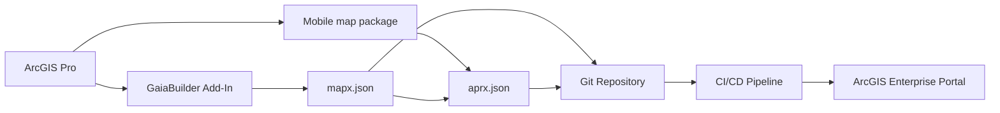
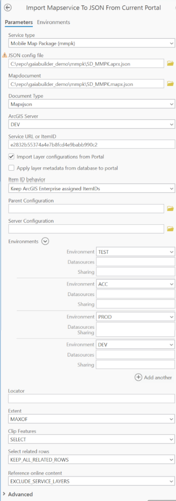
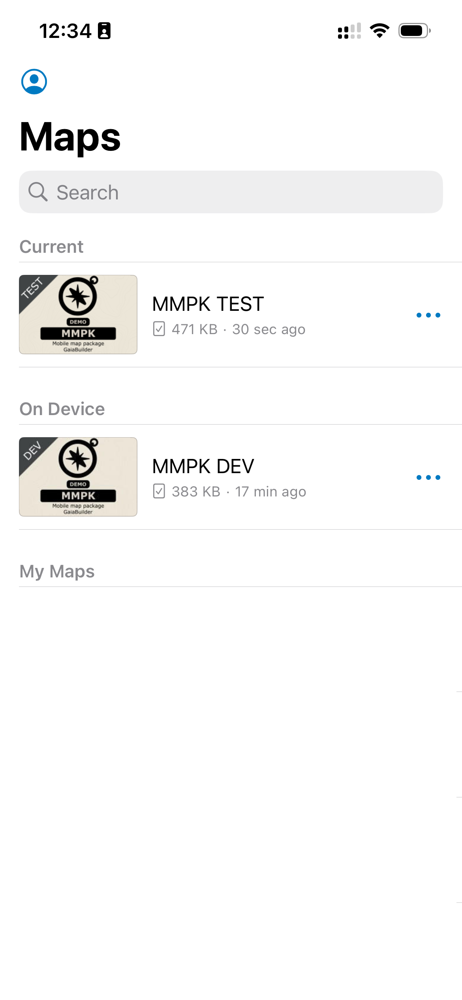

Mobile map package
==================

### 🧠 Assumptions

You are an ArcGIS Pro user who knows how to:

* Share a mobile map package
* Configure thumbnails, metadata, terms of use, and group sharing
* High level knowledge of GaiaBuilder to manage deployments through JSON
* Use version control systems like Git, Subversion or Bitbucket

---
### Overview



### ✅ Step-by-Step Deployment Flow

1. **Create your map in ArcGIS Pro**
   Design your layer symbology, labels, pop-ups, etc.

2. **Share your map as a Mobile map package**
   Use “Mobile Map” to create a mobile map package that can be downloaded from your Portal.
   - We checked the Reference online content option to avoid including data in the package, which keeps it lightweight for this example.

<details>
<summary>Expand for example Share Layer configuration in ArcGIS Pro</summary>


</details>

3. **Configure the Portal item**
   
   Set:
   * 🔖 Thumbnail
   * 📄 Title
   * 🔗 Description
   * 🏷️Summary
   * 📜 Terms of use
   * 👥 Group permissions
   * 🏷️ Tags and categories

5. **Export to GaiaBuilder JSON**

   Use the **GaiaBuilder Add-In** to export map and its metadata into a JSON configuration file, give this a .mapx.json name to illustrate this is the map without credentials, safe to store in a repo in a hardened environment
   * No credentials or sensitive information is exported, this is merged in the build step instead.

   

   * `Map.mapx.json`

   

<details>
<summary>Expand for example Map.mapx.json on our server</summary>

```json
{
  "type": "CIMMapDocument",
  "version": "3.5.0",
  "build": 57366,
  "mapDefinition": {
    "type": "CIMMap",
    "name": "MMPK DEV",
    "uRI": "CIMPATH=Map/Map.json",
    "sourceModifiedTime": {
      "type": "TimeInstant",
      "start": -62135596800000
    },
    "metadataURI": "CIMPATH=Metadata/04c6f187514d978a38bf755d74ff079c.xml",
    "useSourceMetadata": true,
    "illumination": {
      "type": "CIMIlluminationProperties",
      "ambientLight": 50,
      "sunPositionX": -0.61237243569579,
      "sunPositionY": 0.61237243569579,
      "sunPositionZ": 0.5,
      "illuminationSource": "AbsoluteSunPosition",
      "sunAzimuth": 315,
      "sunAltitude": 30,
      "showStars": true,
      "enableAmbientOcclusion": true,
      "enableEyeDomeLighting": true
    },
    "layers": [
      "CIMPATH=Map/demo_dev_demo_LetterFeatures.json",
      "CIMPATH=cf48ca6cf47c4f5699c424f85102dc39.json",
      "CIMPATH=8abf07b2d17f418a8254d2af9a8541cf.json"
    ],
    "defaultViewingMode": "Map",
    "mapType": "Map",
    "groundElevationSurfaceLayer": "CIMPATH=Map/4e3fed14dc574ecdaf364f7dce9a2094.json",
    "defaultColorVisionDeficiencyMode": "None",
    "defaultExtent": {
      "xmin": -117.28316380104995,
      "ymin": 32.69405964535003,
      "xmax": -117.06616017794995,
      "ymax": 32.84150192165003,
      "spatialReference": {
        "wkid": 4326,
        "latestWkid": 4326,
        "xyTolerance": 8.983152841195215E-09,
        "zTolerance": 0.001,
        "mTolerance": 0.001,
        "falseX": -400,
        "falseY": -400,
        "xyUnits": 999999999.9999999,
        "falseZ": -100000,
        "zUnits": 10000,
        "falseM": -100000,
        "mUnits": 10000
      }
    },
    "generalPlacementProperties": {
      "type": "CIMMaplexGeneralPlacementProperties",
      "invertedLabelTolerance": 2,
      "unplacedLabelColor": {
        "type": "CIMRGBColor",
        "values": [
          255,
          0,
          0,
          100
        ]
      },
      "keyNumberGroups": [
        {
          "type": "CIMMaplexKeyNumberGroup",
          "delimiterCharacter": ".",
          "horizontalAlignment": "Left",
          "maximumNumberOfLines": 20,
          "minimumNumberOfLines": 2,
          "name": "Default",
          "numberResetType": "None",
          "keyNumberMethod": "PreventUnplacedLabels"
        }
      ],
      "placementQuality": "High"
    },
    "snappingProperties": {
      "type": "CIMSnappingProperties",
      "xYTolerance": 10,
      "xYToleranceUnit": "SnapXYToleranceUnitPixel",
      "snapToSketchEnabled": true,
      "snapRequestType": "SnapRequestType_GeometricAndVisualSnapping",
      "isZSnappingEnabled": true,
      "snapTipDisplayParts": 3
    },
    "spatialReference": {
      "wkid": 4326,
      "latestWkid": 4326,
      "xyTolerance": 8.983152841195215E-09,
      "zTolerance": 0.001,
      "mTolerance": 0.001,
      "falseX": -400,
      "falseY": -400,
      "xyUnits": 999999999.9999999,
      "falseZ": -100000,
      "zUnits": 10000,
      "falseM": -100000,
      "mUnits": 10000
    },
    "colorModel": "RGB",
    "scaleDisplayFormat": "Value",
    "clippingMode": "None",
    "nearPlaneClipDistanceMode": "Automatic",
    "rGBColorProfile": "sRGB IEC61966-2.1",
    "cMYKColorProfile": "U.S. Web Coated (SWOP) v2",
    "autoFillFeatureCache": true,
    "useMasking": true
  },
  "layerDefinitions": [
    {
      "type": "CIMFeatureLayer",
      "name": "demo_dev.demo.LetterFeatures",
      "uRI": "CIMPATH=Map/demo_dev_demo_LetterFeatures.json",
      "sourceModifiedTime": {
        "type": "TimeInstant"
      },
      "useSourceMetadata": true,
      "description": "demo_dev.demo.LetterFeatures",
      "layerElevation": {
        "type": "CIMLayerElevationSurface"
      },
      "expanded": true,
      "layer3DProperties": {
        "type": "CIM3DLayerProperties",
        "castShadows": true,
        "isLayerLit": true,
        "layerFaceCulling": "None",
        "maxDistance": -1,
        "minDistance": -1,
        "preloadTextureCutoffHigh": 0,
        "preloadTextureCutoffLow": 0.25,
        "textureCutoffHigh": 0.25,
        "textureCutoffLow": 1,
        "useCompressedTextures": true,
        "verticalExaggeration": 1,
        "exaggerationMode": "ScaleZ",
        "verticalUnit": {
          "uwkid": 9001
        },
        "lighting": "OneSideDataNormal",
        "optimizeMarkerTransparency": true
      },
      "layerType": "Operational",
      "showLegends": true,
      "visibility": true,
      "displayCacheType": "Permanent",
      "maxDisplayCacheAge": 5,
      "showPopups": true,
      "serviceLayerID": -1,
      "refreshRate": -1,
      "refreshRateUnit": "esriTimeUnitsSeconds",
      "blendingMode": "Alpha",
      "allowDrapingOnIntegratedMesh": true,
      "autoGenerateFeatureTemplates": true,
      "featureElevationExpression": "Shape.Z",
      "featureTable": {
        "type": "CIMFeatureTable",
        "displayField": "name",
        "editable": true,
        "dataConnection": {
          "type": "CIMStandardDataConnection",
          "workspaceConnectionString": "demo",
          "workspaceFactory": "SDE",
          "dataset": "demo_dev.demo.LetterFeatures",
          "datasetType": "esriDTFeatureClass"
        },
        "studyAreaSpatialRel": "esriSpatialRelUndefined",
        "searchOrder": "esriSearchOrderSpatial"
      },
      "htmlPopupEnabled": true,
      "selectable": true,
      "featureCacheType": "Session",
      "displayFiltersType": "ByScale",
      "featureBlendingMode": "Alpha",
      "layerEffectsMode": "Layer",
      "labelClasses": [
        {
          "type": "CIMLabelClass",
          "expressionTitle": "Custom",
          "expression": "$feature.name",
          "expressionEngine": "Arcade",
          "featuresToLabel": "AllVisibleFeatures",
          "maplexLabelPlacementProperties": {
            "type": "CIMMaplexLabelPlacementProperties",
            "featureType": "Polygon",
            "avoidPolygonHoles": true,
            "canOverrunFeature": true,
            "canPlaceLabelOutsidePolygon": true,
            "canRemoveOverlappingLabel": true,
            "canStackLabel": true,
            "centerLabelAnchorType": "Symbol",
            "connectionType": "Unambiguous",
            "constrainOffset": "NoConstraint",
            "contourAlignmentType": "Page",
            "contourLadderType": "Straight",
            "contourMaximumAngle": 90,
            "enableConnection": true,
            "featureWeight": 0,
            "fontHeightReductionLimit": 4,
            "fontHeightReductionStep": 0.5,
            "fontWidthReductionLimit": 90,
            "fontWidthReductionStep": 5,
            "graticuleAlignmentType": "Straight",
            "keyNumberGroupName": "Default",
            "labelBuffer": 15,
            "labelLargestPolygon": true,
            "labelPriority": -1,
            "labelStackingProperties": {
              "type": "CIMMaplexLabelStackingProperties",
              "stackAlignment": "ChooseBest",
              "maximumNumberOfLines": 3,
              "minimumNumberOfCharsPerLine": 3,
              "maximumNumberOfCharsPerLine": 24,
              "separators": [
                {
                  "type": "CIMMaplexStackingSeparator",
                  "separator": " ",
                  "splitAfter": true
                },
                {
                  "type": "CIMMaplexStackingSeparator",
                  "separator": ",",
                  "visible": true,
                  "splitAfter": true
                }
              ],
              "trimStackingSeparators": true,
              "preferToStackLongLabels": true
            },
            "lineFeatureType": "General",
            "linePlacementMethod": "OffsetCurvedFromLine",
            "maximumLabelOverrun": 80,
            "maximumLabelOverrunUnit": "Point",
            "measureFromClippedFeatureGeometry": true,
            "minimumFeatureSizeUnit": "Map",
            "multiPartOption": "OneLabelPerPart",
            "offsetAlongLineProperties": {
              "type": "CIMMaplexOffsetAlongLineProperties",
              "placementMethod": "BestPositionAlongLine",
              "labelAnchorPoint": "CenterOfLabel",
              "distanceUnit": "Percentage",
              "useLineDirection": true
            },
            "pointExternalZonePriorities": {
              "type": "CIMMaplexExternalZonePriorities",
              "aboveLeft": 4,
              "aboveCenter": 2,
              "aboveRight": 1,
              "centerRight": 3,
              "belowRight": 5,
              "belowCenter": 7,
              "belowLeft": 8,
              "centerLeft": 6
            },
            "pointPlacementMethod": "AroundPoint",
            "polygonAnchorPointType": "GeometricCenter",
            "polygonBoundaryWeight": 0,
            "polygonExternalZones": {
              "type": "CIMMaplexExternalZonePriorities",
              "aboveLeft": 4,
              "aboveCenter": 2,
              "aboveRight": 1,
              "centerRight": 3,
              "belowRight": 5,
              "belowCenter": 7,
              "belowLeft": 8,
              "centerLeft": 6
            },
            "polygonFeatureType": "General",
            "polygonInternalZones": {
              "type": "CIMMaplexInternalZonePriorities",
              "center": 1
            },
            "polygonPlacementMethod": "HorizontalInPolygon",
            "primaryOffset": 1,
            "primaryOffsetUnit": "Point",
            "removeAmbiguousLabels": "All",
            "removeExtraWhiteSpace": true,
            "repetitionIntervalUnit": "Point",
            "rotationProperties": {
              "type": "CIMMaplexRotationProperties",
              "rotationType": "Arithmetic",
              "alignmentType": "Straight"
            },
            "secondaryOffset": 100,
            "secondaryOffsetUnit": "Percentage",
            "strategyPriorities": {
              "type": "CIMMaplexStrategyPriorities",
              "stacking": 1,
              "overrun": 2,
              "fontCompression": 3,
              "fontReduction": 4,
              "abbreviation": 5
            },
            "thinningDistanceUnit": "Point",
            "truncationMarkerCharacter": ".",
            "truncationMinimumLength": 1,
            "truncationPreferredCharacters": "aeiou",
            "truncationExcludedCharacters": "0123456789",
            "polygonAnchorPointPerimeterInsetUnit": "Point"
          },
          "name": "Class 1",
          "priority": -1,
          "standardLabelPlacementProperties": {
            "type": "CIMStandardLabelPlacementProperties",
            "featureType": "Line",
            "featureWeight": "None",
            "labelWeight": "High",
            "numLabelsOption": "OneLabelPerName",
            "lineLabelPosition": {
              "type": "CIMStandardLineLabelPosition",
              "above": true,
              "inLine": true,
              "parallel": true
            },
            "lineLabelPriorities": {
              "type": "CIMStandardLineLabelPriorities",
              "aboveStart": 3,
              "aboveAlong": 3,
              "aboveEnd": 3,
              "centerStart": 3,
              "centerAlong": 3,
              "centerEnd": 3,
              "belowStart": 3,
              "belowAlong": 3,
              "belowEnd": 3
            },
            "pointPlacementMethod": "AroundPoint",
            "pointPlacementPriorities": {
              "type": "CIMStandardPointPlacementPriorities",
              "aboveLeft": 2,
              "aboveCenter": 2,
              "aboveRight": 1,
              "centerLeft": 3,
              "centerRight": 2,
              "belowLeft": 3,
              "belowCenter": 3,
              "belowRight": 2
            },
            "rotationType": "Arithmetic",
            "polygonPlacementMethod": "AlwaysHorizontal"
          },
          "textSymbol": {
            "type": "CIMSymbolReference",
            "symbol": {
              "type": "CIMTextSymbol",
              "blockProgression": "TTB",
              "depth3D": 1,
              "extrapolateBaselines": true,
              "fontEffects": "Normal",
              "fontEncoding": "Unicode",
              "fontFamilyName": "Tahoma",
              "fontStyleName": "Regular",
              "fontType": "Unspecified",
              "haloSize": 1,
              "height": 10,
              "hinting": "Default",
              "horizontalAlignment": "Left",
              "kerning": true,
              "letterWidth": 100,
              "ligatures": true,
              "lineGapType": "ExtraLeading",
              "symbol": {
                "type": "CIMPolygonSymbol",
                "symbolLayers": [
                  {
                    "type": "CIMSolidFill",
                    "enable": true,
                    "color": {
                      "type": "CIMRGBColor",
                      "values": [
                        0,
                        0,
                        0,
                        100
                      ]
                    }
                  }
                ],
                "angleAlignment": "Map"
              },
              "textCase": "Normal",
              "textDirection": "LTR",
              "verticalAlignment": "Bottom",
              "verticalGlyphOrientation": "Right",
              "wordSpacing": 100,
              "billboardMode3D": "FaceNearPlane"
            }
          },
          "useCodedValue": true,
          "visibility": true,
          "iD": -1
        }
      ],
      "renderer": {
        "type": "CIMSimpleRenderer",
        "sampleSize": 10000,
        "patch": "Default",
        "symbol": {
          "type": "CIMSymbolReference",
          "symbol": {
            "type": "CIMPolygonSymbol",
            "symbolLayers": [
              {
                "type": "CIMSolidStroke",
                "enable": true,
                "capStyle": "Round",
                "joinStyle": "Round",
                "lineStyle3D": "Strip",
                "miterLimit": 10,
                "width": 0.7,
                "height3D": 1,
                "anchor3D": "Center",
                "color": {
                  "type": "CIMRGBColor",
                  "values": [
                    110,
                    110,
                    110,
                    100
                  ]
                }
              },
              {
                "type": "CIMSolidFill",
                "enable": true,
                "color": {
                  "type": "CIMRGBColor",
                  "values": [
                    231.71,
                    179.24,
                    252.45,
                    100
                  ]
                }
              }
            ],
            "angleAlignment": "Map"
          }
        }
      },
      "scaleSymbols": true,
      "snappable": true
    },
    {
      "type": "CIMVectorTileLayer",
      "name": "World Topographic Map",
      "uRI": "CIMPATH=cf48ca6cf47c4f5699c424f85102dc39.json",
      "sourceModifiedTime": {
        "type": "TimeInstant"
      },
      "useSourceMetadata": true,
      "layerType": "BasemapBackground",
      "showLegends": true,
      "visibility": true,
      "displayCacheType": "Permanent",
      "maxDisplayCacheAge": 5,
      "showPopups": true,
      "serviceLayerID": -1,
      "refreshRate": -1,
      "refreshRateUnit": "esriTimeUnitsSeconds",
      "webMapLayerID": "VectorTile_2333",
      "blendingMode": "Alpha",
      "allowDrapingOnIntegratedMesh": false,
      "dataConnection": {
        "type": "CIMVectorTileDataConnection",
        "uRI": "https://cdn.arcgis.com/sharing/rest/content/items/7dc6cea0b1764a1f9af2e679f642f0f5/resources/styles/root.json"
      }
    },
    {
      "type": "CIMTiledServiceLayer",
      "name": "World Hillshade",
      "uRI": "CIMPATH=8abf07b2d17f418a8254d2af9a8541cf.json",
      "sourceModifiedTime": {
        "type": "TimeInstant"
      },
      "useSourceMetadata": true,
      "description": "Elevation/World_Hillshade",
      "layerType": "BasemapBackground",
      "showLegends": true,
      "visibility": true,
      "displayCacheType": "Permanent",
      "maxDisplayCacheAge": 5,
      "showPopups": true,
      "serviceLayerID": -1,
      "refreshRate": -1,
      "refreshRateUnit": "esriTimeUnitsSeconds",
      "webMapLayerID": "World_Hillshade_3805",
      "blendingMode": "Alpha",
      "allowDrapingOnIntegratedMesh": false,
      "serviceConnection": {
        "type": "CIMAGSServiceConnection",
        "objectName": "Elevation/World_Hillshade",
        "objectType": "MapServer",
        "url": "https://services.arcgisonline.com/arcgis/rest/services/Elevation/World_Hillshade/MapServer",
        "serverConnection": {
          "type": "CIMInternetServerConnection",
          "anonymous": true,
          "hideUserProperty": true,
          "url": "https://services.arcgisonline.com/arcgis/services"
        }
      },
      "transparentColor": {
        "type": "CIMRGBColor",
        "values": [
          254,
          254,
          254,
          100
        ]
      },
      "backgroundColor": {
        "type": "CIMRGBColor",
        "values": [
          254,
          254,
          254,
          100
        ]
      }
    }
  ],
  "binaryReferences": [
    {
      "type": "CIMBinaryReference",
      "uRI": "CIMPATH=Metadata/04c6f187514d978a38bf755d74ff079c.xml",
      "data": "<?xml version=\"1.0\"?>\r\n<metadata xml:lang=\"en\"><Esri><CreaDate>20260213</CreaDate><CreaTime>12105300</CreaTime><ArcGISFormat>1.0</ArcGISFormat><SyncOnce>TRUE</SyncOnce></Esri><dataIdInfo><idCitation><resTitle>Map</resTitle></idCitation></dataIdInfo><Binary><Thumbnail><Data EsriPropertyType=\"PictureX\">/9j/4AAQSkZJRgABAQEAAAAAAAD/2wBDAAgGBgcGBQgHBwcJCQgKDBQNDAsLDBkSEw8UHRofHh0a\r\nHBwgJC4nICIsIxwcKDcpLDAxNDQ0Hyc5PTgyPC4zNDL/2wBDAQkJCQwLDBgNDRgyIRwhMjIyMjIy\r\nMjIyMjIyMjIyMjIyMjIyMjIyMjIyMjIyMjIyMjIyMjIyMjIyMjIyMjIyMjL/wAARCACFAMgDAREA\r\nAhEBAxEB/8QAHwAAAQUBAQEBAQEAAAAAAAAAAAECAwQFBgcICQoL/8QAtRAAAgEDAwIEAwUFBAQA\r\nAAF9AQIDAAQRBRIhMUEGE1FhByJxFDKBkaEII0KxwRVS0fAkM2JyggkKFhcYGRolJicoKSo0NTY3\r\nODk6Q0RFRkdISUpTVFVWV1hZWmNkZWZnaGlqc3R1dnd4eXqDhIWGh4iJipKTlJWWl5iZmqKjpKWm\r\np6ipqrKztLW2t7i5usLDxMXGx8jJytLT1NXW19jZ2uHi4+Tl5ufo6erx8vP09fb3+Pn6/8QAHwEA\r\nAwEBAQEBAQEBAQAAAAAAAAECAwQFBgcICQoL/8QAtREAAgECBAQDBAcFBAQAAQJ3AAECAxEEBSEx\r\nBhJBUQdhcRMiMoEIFEKRobHBCSMzUvAVYnLRChYkNOEl8RcYGRomJygpKjU2Nzg5OkNERUZHSElK\r\nU1RVVldYWVpjZGVmZ2hpanN0dXZ3eHl6goOEhYaHiImKkpOUlZaXmJmaoqOkpaanqKmqsrO0tba3\r\nuLm6wsPExcbHyMnK0tPU1dbX2Nna4uPk5ebn6Onq8vP09fb3+Pn6/9oADAMBAAIRAxEAPwDgqZIU\r\nAFAE9pZ3N/dJbWkLzTPkqiDJOBk/oDQBBQAUAFAHS+EPCFz4nvsndFYRH99Nj/x1ff8AlUuVhpHu\r\nthYW2mWUVpZwrFBENqoKyNUixilcGZ2s69pPh60+1avqENpF2Mjct7KOrfhQkxXPN9U+PugWshTT\r\ntOvb3H8bERIfpnJ/SrUBcxkL+0Spf5vDBC+ov+f/AEXT5AudHo/xz8Laiyx30d3prn+KVd8f/fS8\r\n/mKlwDmPRLXUbK9sBe2l3DPaFdwmicMmPqKlxHc8gtdf8efEm/vbjwxeQaTo1rL5cbyHBkPudrHO\r\nMHHAGR1rTYRu+BfGOvf8JRc+DvFyxtqkK+ZDcoABKoGcccHjkHA6HPNJoEemVJQnbNIBaAEzQAZo\r\nAWgAoAO9AHy5XQYhQBLbW013L5cMbOQCzbVJ2qOrHHYCgDoW0PWvDVzb61Z+VeW1vIskd5Zv5sWR\r\n2bHK+4YCgCDxbYwW+qrfWS40/Uoxd24H8Ib7yf8AAW3D8qAMCgDpfCHg+58T3uTuisIm/fTev+yv\r\nv/Kpk7DSPdbCwttMsorOzhWKCMYVVrFu5oWaBnn3xJ+Jlt4Nt/sNkEuNZlXKxn7sK/3n/otVGNyW\r\nz58ji8SePNeO37TqeoS8knoo/kq/kK00Qj0zRv2fp5Ilk1rWFhY9YbWPeR/wM/4VPPYdjdb9n/w4\r\nUITVdUD+paMj8ttLnDlOT8Q/AbWLCJ59FvotRVefJdfKk/DkqfzFNSCxwek+INe8GajcQwvNbMcx\r\n3VnMCFcdCGU9/frVWuSWvBfijU/DWs2t3BJfSadBLumtYXOx9wxgj7uTgc+3tQ0M9c8C6drXir4g\r\nz+OtWsX0+1WIxWcLggt8u3vyQBnnuTxUsaPXOazuULQAUAJ0oAWgAoAKADpQB8uV0GIUAegWWltc\r\neFLZPD9xDHa3Kn+2b6VtskOOdjDtHjpj7x/KgZgR3s9jrE83hF7+O3t4tzyZyXVR8zuvQKeuDnFA\r\nEeueKbnXrGztZ7SzgFszvut4tm9mxkkdB07Y5oAs+D/B9z4nvdx3RWETfvZsdf8AZX3/AJVLlYaR\r\n7pY2NtptlFZ2cKxQRDaqLWJZYoGYvizxHD4W8M3usTAN5Kfuoz/y0kPCr+f6ZpxVxM+V9NsNW8e+\r\nLxCJDLf38peWZ+ijqzH0AHb6CtdiT6StLbwv8KvC8YmlW1t9ypJcMhaS4kPrtBJ6HjsKzu2M6TS9\r\nX0/WrFL3TLyG6t36PE2R9D6H2NTaw7nC+GNbN18Z/F1hvygt4No9PKAU/wDj0hqmI9HqRnEfET4e\r\nWfjLTHmhjSHWIU/cT9N/+w/qD+n55qLE0fPXhHxFe+BvFsd0ySJ5UhhvLc8FkzhlI9R1HuK0eoj6\r\n3triG8tYrm3kWSGZFkjcdGUjINYlktABQAUAFACDpQAtACUALQB8uqNzKu4Lk4yegroMTtNUaHwU\r\nbezs9Ns7ySWJZW1G7hEyTgj/AJZA/KFHTPU+1AEv9rRWumweKdKs4bUvObHUtPAzbzZXcML2VgG4\r\n7EUDMjWfEFm1m2maBZyWGnSsJLgO+6SZuu1m/ur0A/E80AP8H+D7nxPe7m3RWER/ezY6/wCyvv8A\r\nyqZOw0j3SxsbbTbKKzs4VigiG1UFYt3LLFAwoA8Q/aD1dwmj6MjEI2+5lHrj5U/9nrSCJZb+AOgp\r\nDpGoa9In76eX7NET2RcFsfViP++aJhE9A8d+Fo/F/hO60w4FyP3tq5/hlXOPz5U+xqYuw2fLWk63\r\nrfhLVnksLqayuomKSx9iQcFXU8H8a0tck6bwF40i074kz+INZnEUV4s7XLIhIBb5gABk/eAAoaA9\r\nz8GeI9V8XTXOsG2FloODFZxSLmWds8yMew4wAPf0rNopHYmp2GfNnx00KPS/GMOowoFi1KHe3/XR\r\nflb9Np+pNaxZDPUfgvqzap8O7eKRi0ljK9qSeu0YZf8Ax1gPwqZDieg1mUxaYBQAGgAoAKACgAoA\r\n+XK6DE6LRNctnsToeuBpNLkbdFKozJZuf409vVe9AEeu6lZizg0TSSz6fbOZHncYa5mIwXx2GOFH\r\np9aBlnwf4PufE95ubdFp8TfvZvX/AGV9/wCVS5WGke52VjbabZRWdnCsUEY2qi9qxLLFAwoAKAPn\r\nL9oDd/wnNjn7v9mpj/v5JWsNiGelfCHzR8J7L7GIjc5uNnmEhN/mNt3Y5x0qZblRKutzfF8bhY22\r\niFextGy3/kUihWBniPizQ/FltfTat4k024ikuJP3lwYlCM5Hqvy54q1Yg5WmB6J4K8S/ES8ZNL8N\r\nXstwttECLd/KISMcfx9uRUsZ7HoEvxRaWIaxb6CsG4eYWdhJjvjZlc1DsUjkf2h9n2Lw+T9/zJ8f\r\nTCZ/pVRQmXP2fC3/AAjWrZzs+2DH12DP9KUwR7DUFBQAmaAFoAO340AIOtAC96ADFAHy5XQYhQB0\r\n/g/wfc+J7ze26LT4m/ezev8Asr7/AMqmTsUke6WNjbabZxWlnEsUES7URe1Yt3LJ6BhQAUAFAHh3\r\n7Qmkt/xJtYRfkAe1kPofvL/7PWkGSy/8Addjn0TUNCkf99bS/aIwe8bYBx9GH/j1KSBHsQqCjgtf\r\n8F3vjfxIH1+QwaBYti2s4n+a5bvI5H3R2A649M1SYrHgLeDtRv8Axlq+g6Rb+dLZSzbYy2CUR9vB\r\nPfpWiZJX0LVtS8EeK7e9aGWG5tJMTQSKUZlPDKQfUf0NAH11p1/b6ppttfWj77e5jWWNvVSM1i0W\r\nj55+O2uJqPi+30yJwyadBtbHaR/mYfkErSC0IZ6X8FdJfTPh5BNIu176d7nB67eFH6KD+NTMaPRP\r\nWpKFoAKACgA7fjQAetABQAUAfLldBidP4P8AB1z4nvN77otPib97N6/7K+/8qlysUke6WVlbabZx\r\nWlpEsUES7URaxLJ+vXpQMWgBKAA0AFAGF4x8Nw+K/C97pEm1XlXdDIR9yQcqfz6+xNOLsJo+WtH1\r\nTVfAfi9bgRNFe2UpjngfgOvRkPsfX6GtbXIPqrw14m03xTpEeoadMHRhiSMn54m/usOxrJxLubFK\r\n9hnm3hfRPsvxo8X3wTCfZ4dp/wCuoDH9YzVN6EpHWeI/B+heKoVTVrCOZ1+5KPlkX6MOce1JMdjA\r\n8ZeL9K+G3hiKwsEj+2LD5dnZg52jpvbvtH6n8aqKuDdj598L6DqHjrxfHaF5He4kM13cHkqmcu59\r\n+fzIq3oTufXNraw2NnBa2yCOCBFjjQdFUDAFYlEw6UDCgAFAAaAEoAWgAoAKAPA/B/g658T3m990\r\nWnxN+9m/vf7K+/8AKtpOxmke6WVlbabZxWlpCsUEa7URe1Yt3LLFAwoAKAEoAKACgAoA85+Jfwxh\r\n8Xxf2lp2yHWYlxluFuFHRW9/RvwPtUZWE0eB2l74j8B68/lPcadfxnDxuMBh7g8MtaWuSeoaL+0C\r\nBEqa5ozFx1ms36/8Ab/4qpcB3Nxvj34UUF0sdUMhHI8mMZ/HfS5Qucr4h+Peo3cTwaFpyWQPH2id\r\nvMcfRfuj8c0+UGzgNI0PxB481xhbrNeXMjbprqYnanuzdvp+VU9Bbn0x4H8EWHgrSPs0H727lw1z\r\nckYMjeg9FHYVk3cpKx1GKQxOlAC0AFABQAnegBaACgAoAr2Vlb6dZxWlpCsUES7URe1AixQMKACg\r\nBOtAC0AJ2oAO1ABQAUAZOu+GtG8SWv2fWLCG6QfdZxhl/wB1hyPwppsVkeaan8ANHndn03WLq0B/\r\ngmRZQP8A0E1XMxWMlf2ep9/zeJItnqLQ5/8AQ6fOFjotH+BPhuydZNSu7rUWHVCRFGfwXn/x6k5h\r\nY9K07TbHSrNLTT7WG1t06RxIFFTqMt1IxaYBQAYoASgAoABQAvegAoAKAEoAWgBKAD9aAFoATrxQ\r\nAGgAoAKACgR8rapcah42+KElhe6hMiTXz28ZBJEKBiAFXPoK20JJNO8F22qy2k1rrFx/Z9wlxlpY\r\nljkR4V3FcF9uCCPm3fXFK6Ada+Am1O3v30/V2L291HAiSsmHUqGdtyOy/KCzcE8Ke/FFwDUPBdnp\r\nFxeNfa1dmyjvIrOCSCDc7u8SybmUsMKAw9zRcCroV3qvgz4kQ2UN65eC+W2mCsdkybwpyPcH8KGB\r\n9W1my0GaQC0AGKACgAoAKADvQAUAFABQAlABQAUAISFUliAB+VAEf2q3/wCe8f8A30KdmFw+0wf8\r\n94/++xSsxaB9pt/+e0f/AH2KLMNA+0wf894/++hTsO6F+0wf89o/++xSsB4Pr3ws8QWfjGfWvDd7\r\nZOj3DXMLPMqvEzHOCGGDjNacxFiv/wAIV8SftsV2LvThJDG8UaiWERqrfeATbt578U7oLFS5+Hfj\r\n68gkhkm01Y5JRMyRTxRjeE2ZwoGPlJFF0Bbj8G/EqK6nuRd6c0k7I8nmTQuu5F2qwVhgMAOo5oug\r\nH+GfhLrj+K7fU/EN7aJDFcC5lYXAkkmYNux+J6k0Nge9/aYP+e0f/fYrJplB9pg/57x/99inqGgv\r\n2m2/57Rf99ijUNA+02//AD2j/wC+xRqGgfabf/ntH/30KNQ0JQQygq2Qe9Kww5oAXNABQAUAJQAU\r\nAFABQB4/+0BeXEOg6TbRTOkM87mVFOA+1RjP5mriSz57yfWtCQz70AGfegAyaAPQtd+Gj6V4Fs/E\r\n1vfPcebFDLNCYtvlq6g5Byc4JAqbjsGqfDSTSPh6niW5v3FyyRyG08rhQ7AD5s9cMD0ouFhdZ+Gk\r\nmm+A7TxPb3z3HmwwzzQeVjy1kUHIOTnBIouFhNR+Gkml/DoeJ7m/dZzHHJ9k8rgB3CjLZ64YHpRc\r\ndi0Ph1oNroejajq3ilrE6pCkkStaFgCVBI3A9BuHJxRcLEK/C2aLx7H4au9SCpNbtcRXSR53KM8F\r\nc8HIPei6FYq6f8P43stY1TVdRaw0mwmkgjn8rc9wysV+Vcj0x9T7GndBY4ZiN52E7c8Z64p2QhmT\r\n60AGT60AGT60AfQn7P15cTaFq1tJM7wwToY0JyE3Kc4/IVnJFRPYagpiGgBe1ABQAnegAoAOtAAO\r\naAPFv2h/+QXoX/XaX/0FauBLPBK0JEoAKACgD3zU/E9p4c0fwcuqRPcaTeaM0F1Cqht37uLBwSM+\r\nn/AjUWKKOu64/iT4P+IdUbKpNqQ8pD/DGHjCj8gKYF3UfE1r4b0DwQdShefSrzRnguoFUNuHlQYO\r\nCQDzx9CaVgKesa+/iX4QeJ9UIZY5NSUQof4Iw8IUfl+uadgJfEGtaTovgPwZNqmgx6sTZxmFZJjG\r\nIyI05xg7s8dfSlYDL8EeKb3xf8XItRvESPFpJHFEn3Y0Azj36nmm0CZr6z9n+JmhalpViBa6xot1\r\nK0VqrYSZQxAOPf17N7NSWgM8OkieCV45EZJFJVlYYKkdQRVkkNABQAUAe+/s8f8AIL13/rtF/wCg\r\ntWcyke0VBQUALQAlABQAUAA60AKBQBxfxI8Bt460m2ggu1tbq1kLxs65RgRgg4/Dn2qlKxLR5b/w\r\nz7ruf+Qxp35P/hVc4WE/4Z813/oMad+Un/xNHOKw3/hQOtf9BvS8btv8fX06U+cLDm+AGtpjdrWm\r\nDJwM7+T+VLnDlBvgHrQZUbW9MDHhVO/Pf29j+VHMHKL/AMM/a9jH9s6dj0/ef/E0cw+UQ/s/a8eu\r\nsadx/v8A+FHMg5Rf+Gftexj+2dOx6Yk/+Jo5wsB/Z914jB1nT+PaT/4mjnDlAfs/a8DxrOnA+wk/\r\n+Jo5xcof8KC1xZAv9t6aHYEgfPkjv29x+dHMOwn/AAz7rx/5jGnH8JP/AImjnFYX/hn3Xf8AoL6d\r\n+T//ABNHOFg/4Z913/oL6d+T/wDxNHOFhf8AhnzXf+gvp35P/wDE0c4WPUPhv4EbwNpF1BNdrc3V\r\n1KHkZFwigDAAz+PNRKVykdpSYwoAKAF+lACd6ACgA+lABQAtACYoAWgRxMnhO7aZ7kMdp1VLz7Nx\r\ngsLoN5u7P/PHI2+w70wI20vXJYIhdQ38vlvA9wou13Syqzb3hO8bFxjjK9uBii4Eg0jxC8ltLnE0\r\nahopJpFYxt5V0q7jzuI8yIE855680Aaej22qxaRfJctdC4dT5SzuCVbZj5W8xzjPqR9BQBUg0jWb\r\nWZJo57yV0eJgk16zI2YyJcgsf4sfT+GgDNii16BLWK+h1Rop7xf3EN1tkI+zylgHMzELuVTy/wCF\r\nNgbOoLqMOkeH7e4+1z3LSLHeCzl2PIRbyFvm3LgblB6ikBnLZeLRdWe0yJJHDseYzbo2PkNy4343\r\nCQr0j5xndzigB8mm6w1xYXNrb30SQxTJdJc3SvNIGaAlY33ttzsb0+6R8u4MC4EN0niCCa/upvtF\r\nvZFiZB9qABUTp/q2aQ7SY9/OIwM9uCABNPi168WyuI5L4WZkcx/vd7oPtDkbyZV3KY/LAPz8A49w\r\nDuxSGL3oATtQAUAAoAB0oAWgBKACgAoAPWgANAC0AFABQAlAGBr2oTW+o2tt9sks4ZIJZfMj8sPL\r\nIpXbGrSfKOGY89cegNNAZMXjMtNYwwZninjUNJLsSVWMTOCQDg8KPuqV569qdhXILzxrdJazxwCP\r\nf9hkdZcrvjmW287JX+L/AL5C8jntRYLlrS/E00F41tqF3HLG1yqfaHljZY0aF35dFVd26I/KQCAw\r\n65FDAhHi+7a2i1Ep+78rzmh3DbzapLjdtyAGbrz/AEpAI/i3UbWe6iVbS+f7RJsdJkjhCxwwNsDM\r\nw5LSNzk4w3BxTsB02kX91qP2mWWGGOCOeSGPa5Zm2OyktxgdO2aTA0+tIYH1oAO9AC0AH+NACdqA\r\nCgBaADpQAYoASgAoAKAA9DQAtACdTQAdsUAFADXijnTbKiunXawyKAEMEWfM8tN+zhtvIHpn05oA\r\nDbQ7i3lJu+6W2jJAoAPs0IXyvLTYuWC7RjI6cUAKI0B2hFA6dPb/ACKAENrBsEXkx7AQQu0YB6A4\r\n9qAHADBwAPp70ALQAd6ACgAoAKADHFAB3oAWgBM0Af/Z</Data></Thumbnail></Binary></metadata>\r\n"
    }
  ],
  "elevationSurfaceLayerDefinitions": [
    {
      "type": "CIMElevationSurfaceLayer",
      "name": "Ground",
      "uRI": "CIMPATH=Map/4e3fed14dc574ecdaf364f7dce9a2094.json",
      "sourceModifiedTime": {
        "type": "TimeInstant"
      },
      "useSourceMetadata": true,
      "description": "Ground",
      "expanded": true,
      "layer3DProperties": {
        "type": "CIM3DLayerProperties",
        "castShadows": true,
        "isLayerLit": true,
        "layerFaceCulling": "None",
        "preloadTextureCutoffHigh": 0.3,
        "preloadTextureCutoffLow": 0.6,
        "textureCutoffHigh": 0.3,
        "textureCutoffLow": 0.6,
        "useCompressedTextures": true,
        "verticalExaggeration": 1,
        "exaggerationMode": "ScaleZ",
        "lighting": "OneSideDataNormal",
        "optimizeMarkerTransparency": true
      },
      "layerType": "Operational",
      "showLegends": false,
      "visibility": true,
      "displayCacheType": "Permanent",
      "maxDisplayCacheAge": 5,
      "showPopups": true,
      "serviceLayerID": -1,
      "refreshRate": -1,
      "refreshRateUnit": "esriTimeUnitsSeconds",
      "blendingMode": "Alpha",
      "allowDrapingOnIntegratedMesh": true,
      "elevationMode": "BaseGlobeSurface",
      "verticalExaggeration": 1,
      "color": {
        "type": "CIMRGBColor",
        "values": [
          255,
          255,
          255,
          100
        ]
      },
      "surfaceTINShadingMode": "Smooth"
    }
  ]
}
```

</details>

5. **Import service configuration**
   This allows GaiaBuilder to recreate or sync services in other environments from the exported JSON. 

   

   ⚠️ Caution: Importing will overwrite any manual changes made outside of GaiaBuilder. Only use if this environment is fully managed through JSON.

<Details><Summary>Example configuration for virtual DTAP environment strategy.</Summary>



</Details>

6. **Keep ArcGIS Enterprise assigned itemIDs (for OTAP)**
   Required when your OTAP environments (Test, Acceptance, Production) share the same ArcGIS Portal instance.
   Optional if each environment has its own dedicated Portal, then you can select Keep ItemIDs from source, to keep the same itemID across environments.

7. **(Optional) Edit server configuration manually**
   For mobile map package it is essential to change the mmpk file name to avoid overriding map packages client side.
   In our example, we also changed the name, portalTitle, portalLogo and datasources for each environment.

<Details>
<Summary>Expand for example Map.Server.json on our server</Summary>

```json
{
    "servers": {
        "ACC": {
            "name": "MMPK ACC",
            "portalTitle": "MMPK ACC",
            "mmpk": "SD_MMPK_ACC.mmpk",
            "portalLogo": "thumbnail_acc.png",
            "datasources": [
                {
                    "databasehint": "demo_acc"
                }
            ],
            "rewrite_outputs": {
                "environmentRewrite": "--ACC--",
                "webUrl": "https://demo.gaiabuilder.com/server/rest/services/ACC"
            },
            "sharing": {
                "esriEveryone": "false",
                "groups": [
                    "Demo ACC"
                ],
                "organization": "true"
            }
        },
        "DEV": {
            "name": "MMPK DEV",
            "portalTitle": "MMPK DEV",
            "mmpk": "SD_MMPK_DEV.mmpk",
            "portalLogo": "thumbnail_dev.png",
            "datasources": [
                {
                    "databasehint": "demo_dev"
                }
            ],
            "rewrite_outputs": {
                "environmentRewrite": "--DEV--",
                "webUrl": "https://demo.gaiabuilder.com/server/rest/services/DEV"
            },
            "sharing": {
                "esriEveryone": "false",
                "groups": [
                    "Demo DEV"
                ],
                "organization": "true"
            }
        },
        "PROD": {
            "name": "MMPK PROD",
            "portalTitle": "MMPK PROD",
            "mmpk": "SD_MMPK_PROD.mmpk",
            "portalLogo": "thumbnail_prod.png",
            "datasources": [
                {
                    "databasehint": "demo_prod"
                }
            ],
            "rewrite_outputs": {
                "environmentRewrite": "--PROD--",
                "webUrl": "https://demo.gaiabuilder.com/server/rest/services/PROD"
            },
            "sharing": {
                "esriEveryone": "false",
                "groups": [
                    "Demo DEV"
                ],
                "organization": "true"
            }
        },
        "TEST": {
            "name": "MMPK TEST",
            "portalTitle": "MMPK TEST",
            "mmpk": "SD_MMPK_TEST.mmpk",
            "portalLogo": "thumbnail_test.png",
            "datasources": [
                {
                    "databasehint": "demo_test"
                }
            ],
            "rewrite_outputs": {
                "environmentRewrite": "--TEST--",
                "webUrl": "https://demo.gaiabuilder.com/server/rest/services/TEST"
            },
            "sharing": {
                "esriEveryone": "false",
                "groups": [
                    "Demo DEV"
                ],
                "organization": "true"
            }
        }
    }
}
```
</Details>

8. **Commit and push to version control**
   Store the JSON files in Git (or other VCS) for reproducible deployments and rollback support.

   <Details><Summary>List of the files stored in git on our environment</Summary>

📄 SD_MMPK.aprx.json
📄 SD_MMPK.mapx.json
📄 thumbnail_acc.png
📄 thumbnail_dev.png
📄 thumbnail_prod.png
📄 thumbnail_test.png
📄 thumbnail.png

</Details>

9. **Integrate into your CI/CD system**
    You can run GaiaBuilder in any automation environment:

* GitHub Actions
* GitLab CI
* Jenkins
* Azure DevOps
* TeamCity
* Cron-based scripts

---

## 🧪 Generic Deployment Script (PowerShell)

This example works on any runner or agent that supports PowerShell and Python (with Conda) [^1]:

```powershell
& "$env:CondaHook"
conda activate "$env:CondaEnv_GaiaBuilder"

$scriptPath = "C:\GaiaBuilder\InstallMapservice_lite.py"

$args = @(
  "-f", $env:manual_build_list,   # Required: Relative path to the JSON config file (MapService definition)
  "-s", $env:server,              # Required: Server config name from JSON / global INI
  "-r", "false",                  # Optional (default true): Replace datasources
  "-q", "true",                   # Optional (default false): Restore .mapx.json to .mapx (use with -m true and -r false)
  "-c", "true",                   # Optional (default true): Create .sd service definition file
  "-d", "false",                  # Optional (default false): Delete service (removes related items)
  "-h", "true",                   # Optional (default true): Stop service before replace
  "-i", "true",                   # Optional (default true): Install .sd to server (requires -c or .sd in PUB folder)
  "-a", "true",                   # Optional (default true): Configure service from JSON
  "-z", "true",                   # Optional (default true): Start service after install
  "-m", "true",                   # Optional (default false): Import .mapx into empty ArcGIS Pro project
  "-t", "false"                   # Optional (default false): Create/update tile cache
)

python $scriptPath $args
```

### 🔐 Environment Variables
The -u and -p arguments are not safe to use in most CI environments and are intended for standalone use only.
Instead, set these values securely using your CI/CD environment's secret store. As of version 3.11, you can use either `USER` and `PASSWORD` or an `API_KEY` for authentication, depending on your needs. See [Security Best Practices](../../docs/Security-Best-Practices.md) for details.
```yaml
env:
  USER: $(USER)
  PASSWORD: $(PASSWORD)
  API_KEY: $(API_KEY)  # Use either this or USER/PASSWORD, not all together
```

This ensures your credentials and API keys do not appear in logs or version control.

---
After provisioning, verify your mobile map package can download in the Fieldmaps application.


[^1]: ## 🧾 GaiaBuilder CLI Options
InstallMapserviceTool and the light version (without an arcpy dependency) command line options are documented [here](https://github.com/merkator-software/GaiaBuilder-manual/wiki/InstallMapserviceTool)


