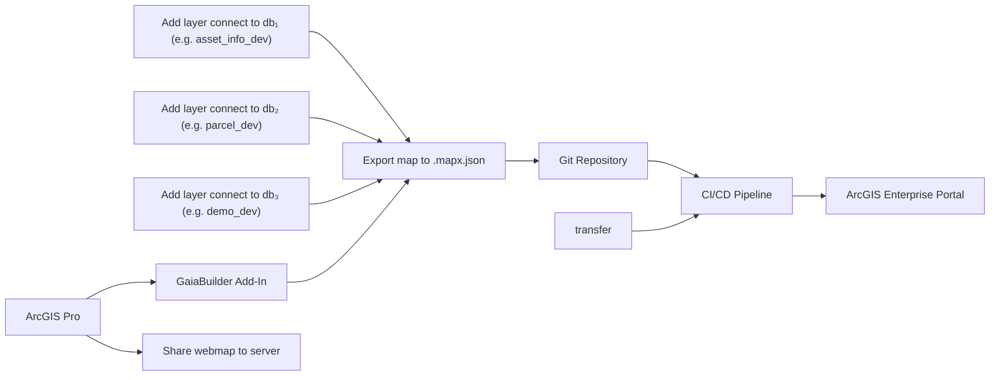
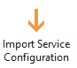
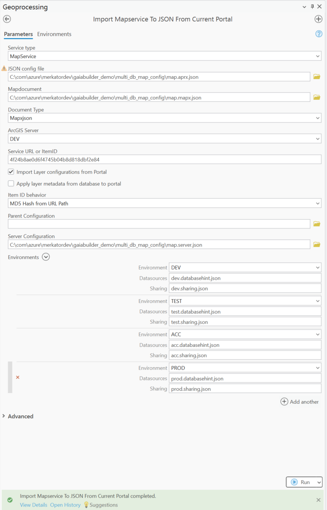

Multi DB Map config
===================
### 🆕 Advanced configuration of datasource per layer
As of version 3.11 different layers can connect to different databases with the same database user, enhancing the database hints by providing a per layer hint.

### 🧠 Assumptions

You are an ArcGIS Pro user who knows how to:

* Publish a web service and web map
* Configure thumbnails, metadata, terms of use, and group sharing
* High level knowledge of GaiaBuilder to manage deployments through JSON
* Use version control systems like Git, Subversion or Bitbucket

---
### Overview



### ✅ Step-by-Step Deployment Flow

1. **Create your image map in ArcGIS Pro**
    Drag and drop your image files into the map.
    Create pyramids if needed.
    Design your layer symbology, labels, pop-ups, etc.

2. **Publish as Web Map to ArcGIS Portal**
   Use “Share as Web Map” to publish the image layer to your Portal.
      
⚠ Before publishing check the _Allow assignment of unique numeric IDs for sharing web layers_ under map properties — General.

3. **Configure the Portal item**
   
   Set:
   * 🔖 Thumbnail
   * 📄 Title
   * 🔗 Description
   * 🏷️ Summary
   * ©️  Attribution
   * 📜 Terms of use
   * 👥 Group permissions
   * 🏷️ Tags and categories

4. ** Set the database hint **
   After setting the default database hint, you can set the per layer hint by clicking on the _Load Active Map_ button under Add-In tab — Export Map to JSON chevron down — Generate Mapx JSON Import configuration.
   

5. **Import service configuration**
   This allows GaiaBuilder to recreate or sync services in other environments from the exported JSON. 
   
   
   
   >⚠️ Caution: Importing will overwrite any manual changes made outside of GaiaBuilder. Only use if this environment is fully managed through JSON.

<Details><Summary>Example configuration for virtual DTAP environment strategy.</Summary>
Our configuration has been designed to support a virtual DTAP (Development, Test, Acceptance, Production) environment strategy. Each environment has its own folder in the ArcGIS Portal and a dedicated server folder.


</Details>

6. **Configure environments**
   Remove the environments you do not want to configure for this deployment. Then set the Datasources created in step 4, prepend the database hint with the environment prefix or suffix, e.g. `dev.`, `test.`, `acc.`, `prod.`.
   The sharing configuration is also set per environment, tying in the datasources, portal item rewrites, and group sharing.
<Details><Summary>Example dev.databasehint.json from our environment.</Summary>

```json
{
  "layers": [
    {
      "layerName": "LetterFeatures",
      "username": "demo",
      "serviceLayerId": 3,
      "databaseHint": "demo_dev;"
    },
    {
      "layerName": "Parcels of San Diego County",
      "username": "demo",
      "serviceLayerId": 4,
      "databaseHint": "parcel_dev;"
    },
    {
      "layerName": "Trolley Lines",
      "username": "demo",
      "serviceLayerId": 1,
      "databaseHint": "asset_info_dev;"
    },
    {
      "layerName": "Trolley Stations",
      "username": "demo",
      "serviceLayerId": 2,
      "databaseHint": "asset_info_dev;"
    }
  ],
  "mapx": "map.mapx.json",
  "defaulthint": "demo_dev;"
}
```

</Details>

7. **(Optional) Edit server configuration manually**
   For advanced scenarios, edit the server JSON directly to override publishing behavior.

<Details>
<Summary>Expand for example Server.json</Summary>

```json
{
    "servers": {

        "ACC_IMAGE": {        
            "portalFolder": "acc",        
            "serverFolder": "ACC",
            "datasources": [],
            "sharing": {
                "esriEveryone": "false",
                "groups": [
                    "Demo ACC"
                ],
                "organization": "false"
            }
        },
        "DEV_IMAGE": {
            "portalFolder": "dev",        
            "serverFolder": "DEV",
            "datasources": [],
            "sharing": {
                "esriEveryone": "false",
                "groups": [
                    "Demo DEV"
                ],
                "organization": "false"
            }
        },
        "PROD_IMAGE": {
            "portalFolder": "prod",        
            "serverFolder": "PROD",
            "datasources": [],
            "sharing": {
                "esriEveryone": "false",
                "groups": [
                    "Demo PROD"
                ],
                "organization": "false"
            }
        },
        "TEST_IMAGE": {
            "portalFolder": "test",        
            "serverFolder": "TEST",
            "datasources": [],
            "sharing": {
                "esriEveryone": "false",
                "groups": [
                    "Demo TEST"
                ],
                "organization": "false"
            }
        }
    }
}
```
</Details>

8. **Commit and push to version control**
   Store the JSON files in Git (or other VCS) for reproducible deployments and rollback support.

   <Details><Summary>List of the files stored in git on our environment</Summary>

   * `5a371e21be223df6691b919542cc8d4b.data.json`
   * `Map.aprx.json`
   * `Map.mapx.json`
   * `Map.Server.json`
   * `thumbnail.PNG`
</Details>

9. **Integrate into your CI/CD system**
    You can run GaiaBuilder in any automation environment:

* GitHub Actions
* GitLab CI
* Jenkins
* Azure DevOps
* TeamCity
* Cron-based scripts

---

## 🧪 Generic Deployment Script (PowerShell)

This example works on any runner or agent that supports PowerShell and Python (with Conda) [^1]:

It is identitical to the Publish a Map Service script, but some parameters are not used.

```powershell
& "$env:CondaHook"
conda activate "$env:CondaEnv_GaiaBuilder"

$scriptPath = "C:\GaiaBuilder\InstallMapservice_lite.py"

$args = @(
  "-f", $env:manual_build_list,   # Required: Relative path to the JSON config file (MapService definition)
  "-s", $env:server,              # Required: Server config name from JSON / global INI
  "-r", "false",                  # Optional (default true): Replace datasources
  "-q", "true",                   # Optional (default false): Restore .mapx.json to .mapx (use with -m true and -r false)
  "-c", "true",                   # Optional (default true): Create .sd service definition file
  "-d", "false",                  # Optional (default false): Delete service (removes related items)
  "-h", "true",                   # Optional (default true): Stop service before replace
  "-i", "true",                   # Optional (default true): Install .sd to server (requires -c or .sd in PUB folder)
  "-a", "true",                   # Optional (default true): Configure service from JSON
  "-z", "true",                   # Optional (default true): Start service after install
  "-m", "true",                   # Optional (default false): Import .mapx into empty ArcGIS Pro project
  "-t", "false"                   # Optional (default false): Create/update tile cache
)

python $scriptPath $args
```

### 🔐 Environment Variables

The -u and -p arguments are not safe to use in most CI environments and are intended for standalone use only.
Instead, set these values securely using your CI/CD environment's secret store:

```yaml
env:
  USER: $(USER)
  PASSWORD: $(PASSWORD)
```

This ensures your credentials do not appear in logs or version control.

---
After deployment, verify your map service in the ArcGIS REST Services Directory or ArcGIS Pro Catalog before promoting to higher environments.


[^1]: ## 🧾 GaiaBuilder CLI Options
InstallMapserviceTool and the light version (without an arcpy dependency) command line options are documented [here](https://github.com/merkator-software/GaiaBuilder-manual/wiki/InstallMapserviceTool)


