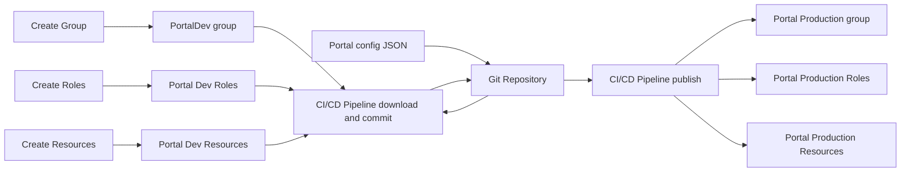

Manage Portal Groups, Roles or Resources
============================

### 🧠 Assumptions

You are an ArcGIS Pro user who knows how to:

* Manage Portal configurations
* Configure thumbnails, metadata
* High level knowledge of GaiaBuilder to manage deployments through JSON
* Use version control systems like Git, Subversion or Bitbucket

---
###
Portal configurations such as groups and roles can be managed by GaiaBuilder. This includes also the Portal Homepage and other resources.
You can create a JSON config for an individual group or multiple groups
Roles and Resources are all managed by one central JSON config

---
### Overview


### ✅ Step-by-Step Deployment Flow

1. **Create Groups, Roles and Resources**
    Create the Groups, Roles and Resources. 

2. **Configure the Group or Portal Home Page**
   
   Set:
   * 🔖 Thumbnail
   * 📄 Title
   * 🔗 Description
   * 🏷️ Summary
   * ©️  Attribution
   * 📜 Terms of use
   * 🏷️ Tags and categories

3. **Create the content project**
You can combine groups, roles and resources into one JSON, but it is adviced to do this only when there are links between them. Splitting it into multiple configurations gives you more granular control. You can take one of the example json files in this repo as an template right now. With a future update, a ArcGIS Pro GUI will be provided

4. Create the pipeline files, you'll need a pipeline for fetching the configuration from the source Portal and making the commit and another one for deploying to the target Portal, example pipelines can be found in this repository

5. **Commit and push to version control**
   Store the JSON files in Git (or other VCS) for reproducible deployments and rollback support together with the pipeline yaml files

   <Details><Summary>List of the files stored in git on our environment</Summary>

   * `portalconfig.json`
   * `portal_config.yml`
   * `portal_import.yml`
</Details>

6. **Integrate into your CI/CD system**
    See See [Publishing an Experience Builder App](../Publishing an experience builder app/README.md) for details on configuring the deployment pipeline for deploying this content project to the other stages in your environment.
    You can run GaiaBuilder in any automation environment:

* GitHub Actions
* GitLab CI
* Jenkins
* Azure DevOps
* TeamCity
* Cron-based scripts

7.  **Run the pipeline to import the configurations and commit to GIT**
The pipeline will read the JSON config and save the portal config for the configured groups, all roles or all resources to the GIT and commit the resources

8. **Run the pipeline to configure the next stage(s)**

---

## 🧪 Deployment Script (PowerShell)

This example works on any runner or agent that supports PowerShell and Python (with Conda):

```powershell
& "$env:CondaHook"
conda activate "$env:CondaEnv_GaiaBuilder"

$scriptPath = "C:\GaiaBuilder\Portalconfig.py"

$args = @(
  "-f", $env:manual_build_list,   # Required: Relative path to the JSON config file (MapService definition)
  "-s", $env:server,              # Required: Server config name from JSON / global INI
  "-a", "import",                   # Required: import
)

python $scriptPath $args
```

### 🔐 Environment Variables
The -u and -p arguments are not safe to use in most CI environments and are intended for standalone use only.
Instead, set these values securely using your CI/CD environment's secret store. As of version 3.11, you can use either `USER` and `PASSWORD` or an `API_KEY` for authentication, depending on your needs. See [Security Best Practices](../../docs/Security-Best-Practices.md) for details.
```yaml
env:
  USER: $(USER)
  PASSWORD: $(PASSWORD)
```

This ensures your credentials do not appear in logs or version control.


