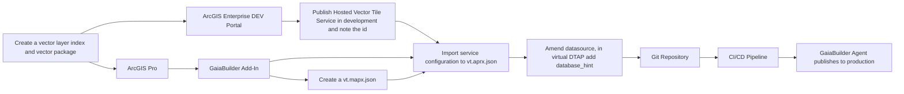
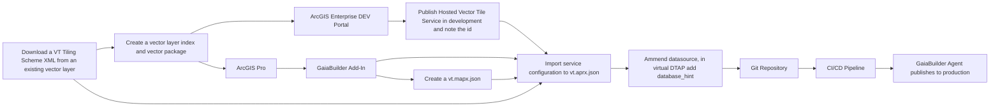
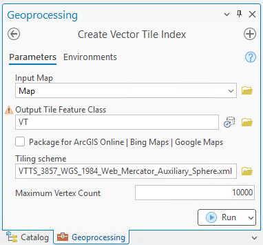
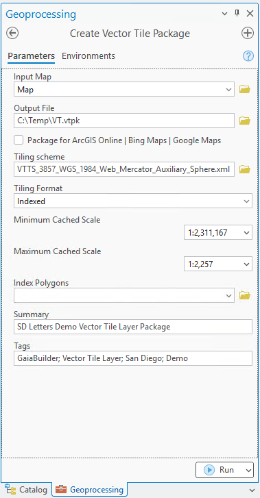
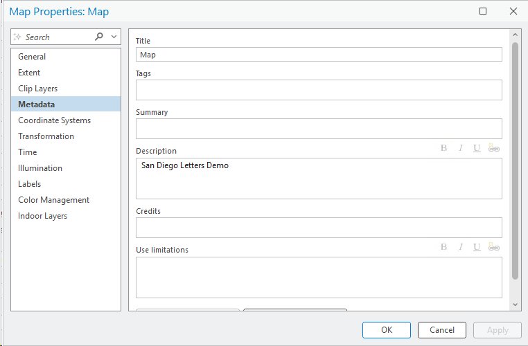
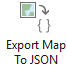
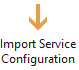
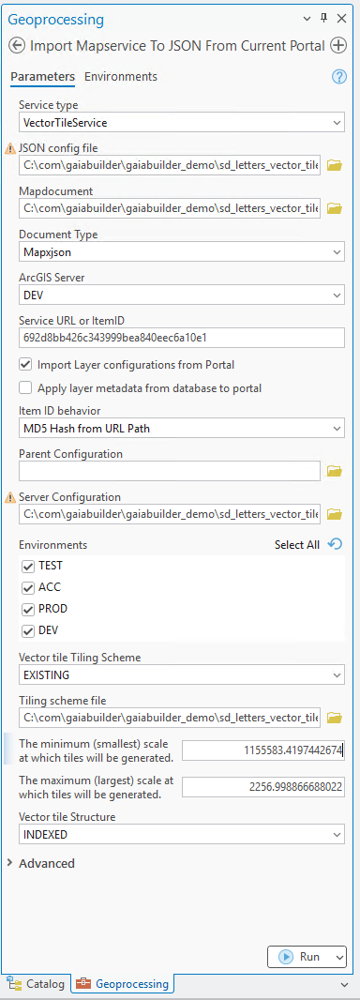

# Publishing a Hosted Vector Tile Layer

This guide demonstrates how to publish a hosted vector tile layer to ArcGIS Enterprise using GaiaBuilder and ArcGIS Pro’s geoprocessing tools.

## Prerequisites

### 🧠 Assumptions

You should be familiar with:

* ArcGIS Pro and the Geoprocessing pane
* GaiaBuilder Add-In (v3.10 or higher) for JSON-based deployments
* Hosted vector tile layers in ArcGIS Enterprise
* Version control for JSON configurations

Ensure you have:

* GaiaBuilder Add-In (Version 3.10 or higher) installed in ArcGIS Pro
* Access to your ArcGIS Enterprise Portal or Server
* At least one feature in your database to create a hosted vector tile layer

### Overview

Publishing for use with the ArcGIS Online/Bing Maps/Google Maps tiling scheme. 


Publishing for use with an existing tiling scheme.

> ⚠️In a Virtual DTAP environment, the layer is always imported into the root directory, so the name of the vector tile layer and the vt package attributes should be added to the vt.server.json.
> This will be demonstrated in the steps below.

## ✅ Step-by-Step Deployment Flow

### Step 1: Create the Vector Tile Layer Index and Package

1. (Optional) Download a VT Tiling Scheme XML from an existing vector layer if you want to use an existing tiling scheme. This is useful if you have a specific tiling scheme that you want to apply to your vector tile service.
2. Run the **Create Vector Layer Index** tool in ArcGIS Pro to create a vector layer index for your feature layer. This is essential for vector tile generation.
    - Specify whether the tiling scheme will be generated from an existing map service or for ArcGIS Online, Bing Maps, and Google Maps.
        *	Checked—The ArcGIS Online/Bing Maps/Google Maps tiling scheme will be used. The ArcGIS Online/Bing Maps/Google Maps tiling scheme allows you to overlay cache tiles with tiles from these online mapping services. ArcGIS Pro includes this tiling scheme as a built-in option when loading a tiling scheme. When you check this parameter, the data frame of the source map must use the WGS84 Web Mercator (Auxiliary Sphere) projected coordinate system. This is the default.
        *	Unchecked—The tiling scheme from an existing vector tile service will be used. Only tiling schemes with scales that double in progression through levels and have 512-by-512 tile size are supported. You must specify a vector tile service or tiling scheme file for the Tiling scheme parameter.
<Details><summary>Example Create Vector Layer Index</summary>


</Details>
3. The layer is automatically added to the map, this can be safely removed from the map. So you can continue with the export of the `vt.mapx.json` in a later step.
4. Run the **Create Vector Package** tool to generate a vector tile package (`.vtpk`) from the vector layer index.
<Details><summary>Example Create Vector Package</summary>


</Details>

   - Ensure you set the **Tiling scheme** to `EXISTING` if you are using an existing tiling scheme, or leave it unchecked for the ArcGIS Online/Bing Maps/Google Maps tiling scheme.
   - Set the **Minimum scale** and **Maximum scale** according to your requirements.
   - Set the **Vector tile structure** to `INDEXED` for optimal performance.
5. Publish the vector tile package to your ArcGIS Enterprise Portal or Server. This will create a hosted vector tile service, note down the id.

### Step 2: Publish the package to the development portal
1. Go To content -> New Item, drop the `.vtpk` file, and select the **Vector Tile Package and layer** option.
2. Move the `.vtpk` file to the `dev` folder in a virtual DTAP environment.
3. Be sure the ownership of the imported layer is set to the same user which runs the GaiaBuilder Add-On.
Finish of the configuration of the portal item set:

* 🔖 Thumbnail
* 📄 Title
* 📖 Description
* 📝 Summary
* 📜 Terms of use
* 👥 Group permissions
* 🏷️ Tags and categories

Note the id of the hosted vector tile service, as you will need it in step 4.

### Step 3 Export the mapx JSON configuration file (`vt.mapx.json`) without the index layer.
1. Configure the description of the map under metadata in the map properties.
<Details><summary>Example Map Properties</summary>


</Details>



### Step 4: Import Hosted Vector Tile Service



<Details><summary>Example import mapservice parameters</summary>


</Details>

1. Configure parameters:

   * **Service Type**: `VectorTileService`
   * **JSON config file**: `vt.aprx.json` under `sd_letters_vector_tile_service`
   * **Map document**: `vt.mapx.json` under `sd_letters_vector_tile_service`
   * **Document Type**: `mapxjson`
   * **Service URL or ItemID**: your hosted vector tile ItemID
   * **Item ID behavior**: `MD5 hash`
   * **Server configuration**: `vt.server.json`
   * **Vector Tiling Scheme**: `EXISTING`
   * **Tiling scheme file**:
     `VTTS_3857_WGS_1984_Web_Mercator_Auxiliary_Sphere.xml` under `sd_letters_vector_tile_service`
   * **Minimum scale**: `1155583.4197442674`
   * **Maximum scale**: `2256.998866688022`
   * **Vector tile structure**: `INDEXED`

> The minimum and maximum scale values are copied from the vector layer index downloaded in Step 1, and should be multiples of 2 to be valid for vector tile services.

2. Click **Run** and confirm success.

### Step 5: Configure the `vt.server.json` and `vt.aprx.json`

1. Using your preferred text editor, open the `vt.server.json` file located in the `sd_letters_vector_tile_service` folder.
2. (Optional) For a Virtual DTAP environment, ensure the following attributes are specified:
   * **name**: Make the layer names unique, as they are placed in the root of services.
   * **vtpk**: Set the name of the generated vtpk to a unique name.
   * **database_hints**: Add the database hints to the virtual DTAP environment.
3. Configure the rewrites in both the `vt.aprx.json` and `vt.server.json` files:
   * In `vt.aprx.json`, add the `rewrite_inputs` section.
   * In `vt.server.json`, add the `rewrite_outputs` sections.

<Details><summary>Example vt.server.json and vt.aprx.json Configuration</summary>

`vt.server.json`
```json
{
    "servers": {
        "ACC": {
            "name": "SD_Letters_Vector_Tile_ACC",
            "portalFolder": "acc",
            "datasources": [
                {
                    "databasehint": "demo_acc"
                }],
            "rewrite_outputs": {
                "environmentRewrite": "--ACC--",
                "webUrl": "https://demo.gaiabuilder.com/server/rest/services/ACC"
            },
            "sharing": {
                "esriEveryone": "false",
                "groups": [
                    "Demo ACC"
                ],
                "organization": "false"
            },
            "vtpk": "vt_acc.vtpk"
        },
        "DEV": {
            "name": "SD_Letters_Vector_Tile_DEV",
            "portalFolder": "dev",
            "datasources": [
                {
                    "databasehint": "demo_dev"
                }
            ],
            "rewrite_outputs": {
                "environmentRewrite": "--DEV--",
                "webUrl": "https://demo.gaiabuilder.com/server/rest/services/DEV"
            },
            "sharing": {
                "esriEveryone": "false",
                "groups": [
                    "Demo DEV"
                ],
                "organization": "false"
            },
            "vtpk": "vt_dev.vtpk"
        },
        "PROD": {
            "name": "SD_Letters_Vector_Tile_PROD",
            "portalFolder": "prod",
            "datasources": [
                {
                    "databasehint": "demo_prod"
                }],
            "rewrite_outputs": {
                "environmentRewrite": "--PROD--",
                "webUrl": "https://demo.gaiabuilder.com/server/rest/services/PROD"
            },
            "sharing": {
                "esriEveryone": "false",
                "groups": [
                    "Demo PROD"
                ],
                "organization": "false"
            },
            "vtpk": "vt_prod.vtpk"
        },
        "TEST": {
            "name": "SD_Letters_Vector_Tile_TEST",
            "portalFolder": "test",
            "datasources": [
                {
                    "databasehint": "demo_test"
                }],
            "rewrite_outputs": {
                "environmentRewrite": "--TEST--",
                "webUrl": "https://demo.gaiabuilder.com/server/rest/services/TEST"
            },
            "sharing": {
                "esriEveryone": "false",
                "groups": [
                    "Demo TEST"
                ],
                "organization": "false"
            },
            "vtpk": "vt_test.vtpk"
        }
    }
}
```

`vt.aprx.json`
```json
{
    "action": "publishVectortile",
    "aprx": "vt.aprx",
    "categories": [],
    "clientCachingAllowed": "true",
    "contentUser": "demo.professional.plus",
    "content_status": "",
    "credits": "",
    "description": "<div style='text-align:Left;font-size:12pt'><div><div><p><span>San Diego Letters Demo</span></p></div></div></div>",
    "exportTilesAllowed": "false",
    "layerDataJson": "2de07e0c68544e27b104246565397087.data.json",
    "lyrx": null,
    "lyrxjson": null,
    "mapx": "vt.mapx",
    "mapxjson": "vt.mapx.json",
    "maxBufferCount": "100",
    "maxExportTilesCount": "100000",
    "maxLOD": "17",
    "max_cached_scale": 2256.998866688022,
    "minLOD": "8",
    "min_cached_scale": 1155583.4197442674,
    "name": "SD_Letters_Vector_Tile_DEV",
    "origin": {
        "document": "vt.mapx.json",
        "documentType": "Mapxjson",
        "environments": "TEST,ACC,PROD,DEV",
        "imagepath": "",
        "importlayerconfig": "true",
        "itemid": "MD5 Hash from URL Path",
        "metadatafromlayer": "false",
        "server": "DEV",
        "serviceType": "VectorTileService",
        "serviceurl": "2de07e0c68544e27b104246565397087"
    },
    "packagesourceitemid": "fb9a53ec5e1f414ebcb2af21804345b2",
    "portalFolder": "dev",
    "portalLogo": "thumbnail.png",
    "portalTitle": "SD_Letters_Vector_Tile_--DEV--",
    "portaldescription": "<div style='text-align:Left;font-size:12pt'><div><div><p><span>San Diego Letters Demo</span></p></div></div></div>",
    "protected": "false",
    "rewrite_inputs": {
        "environmentRewrite": "--DEV--",
        "webUrl": "https://demo.gaiabuilder.com/server/rest/services/DEV"
    },
    "serverconfiguration": "vt.server.json",
    "service_type": "EXISTING",
    "sourceitemid": "2de07e0c68544e27b104246565397087",
    "summary": "San Diego Letters Demo",
    "tags": "GaiaBuilder,CICD,Vector Tile,Package,Dev",
    "tile_structure": "INDEXED",
    "tiling_scheme": "VTTS_3857_WGS_1984_Web_Mercator_Auxiliary_Sphere.xml",
    "uselimitations": "",
    "vtpk": "vt_dev.vtpk"
}
```
</Details>

> ⚠️ All sensitive information, is stored in the `GaiaBuilder.ini` and stored under `Connections` in a `demo.gaiabuilder.com.ags` file, 
or is located using the python libraries provided by the GaiaBuilder Add-In.

### Step 6: **Commit and push to version control**
   Store the JSON files in Git (or other VCS) for reproducible deployments and rollback support.

   <Details><Summary>List of the files stored in git on our environment</Summary>

- 📄 `2de07e0c68544e27b104246565397087.data.json`
- 📄 `692d8bb426c343999bea840eec6a10e1.data.json`
- 🖼️ `thumbnail.png`
- 📄 `vt.aprx.json`
- 📄 `vt.mapx.json`
- 📄 `vt.server.json`
- 🗺️ `VTTS_3857_WGS_1984_Web_Mercator_Auxiliary_Sphere.xml`

</Details>

### Step 7: **Integrate into your CI/CD system**
    You can run GaiaBuilder in any automation environment:

* GitHub Actions
* GitLab CI
* Jenkins
* Azure DevOps
* TeamCity
* Cron-based scripts

---

## 🧪 Generic Deployment Script (PowerShell)

This example works on any runner or agent that supports PowerShell and Python (with Conda) [^1].
```powershell
& "$env:CondaHook"
conda activate "$env:CondaEnv_GaiaBuilder"

$scriptPath = "C:\GaiaBuilder\InstallMapservice_lite.py"

$args = @(
  "-f", $env:manual_build_list,   # Required: Relative path to the JSON config file (MapService definition)
  "-s", $env:server,              # Required: Server config name from JSON / global INI
  "-r", "false",                  # Optional (default true): Replace datasources
  "-q", "true",                   # Optional (default false): Restore .mapx.json to .mapx (use with -m true and -r false)
  "-c", "true",                   # Optional (default true): Create .sd service definition file
  "-d", "false",                  # Optional (default false): Delete service (removes related items)
  "-h", "true",                   # Optional (default true): Stop service before replace
  "-i", "true",                   # Optional (default true): Install .sd to server (requires -c or .sd in PUB folder)
  "-a", "true",                   # Optional (default true): Configure service from JSON
  "-z", "true",                   # Optional (default true): Start service after install
  "-m", "true",                   # Optional (default false): Import .mapx into empty ArcGIS Pro project
  "-t", "false"                   # Optional (default false): Create/update tile cache
)

python $scriptPath $args
```

### 🔐 Environment Variables
The -u and -p arguments are not safe to use in most CI environments and are intended for standalone use only.
Instead, set these values securely using your CI/CD environment's secret store. As of version 3.11, you can use either `USER` and `PASSWORD` or an `API_KEY` for authentication, depending on your needs. See [Security Best Practices](../../docs/Security-Best-Practices.md) for details.
```yaml
env:
  USER: $(USER)
  PASSWORD: $(PASSWORD)
  API_KEY: $(API_KEY)  # Use either this or USER/PASSWORD, not all together
```
This ensures your credentials do not appear in logs or version control.

---

[^1]: ## 🧾 GaiaBuilder CLI Options
InstallMapserviceTool and the light version (without an arcpy dependency) command line options are documented [here](https://github.com/merkator-software/GaiaBuilder-manual/wiki/InstallMapserviceTool)


