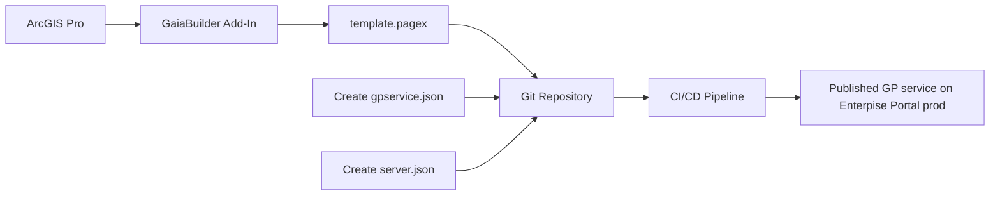

Publish a print service
=======================
> **Note:** Throughout this document, the term **GeoProcessing** will be abbreviated as **GP**.

### 🧠 Assumptions

You are an ArcGIS Pro user who knows how to:

* Publish a GP service and know how to author and export a layout in ArcGIS Pro
* Configure thumbnails, metadata, terms of use, and group sharing
* High level knowledge of GaiaBuilder to manage deployments through JSON
* Use version control systems like Git, Subversion or Bitbucket

---
### Overview



### ✅ Step-by-Step Deployment Flow

1. **Create your layout in ArcGIS Pro**
   Design your print layout symbology, labels, pop-ups, and other properties in ArcGIS Pro.

2. **Create `gpservice.json`**
    
   From the example template, create a `gpservice.json` file that defines the print service configuration. This file will be used by GaiaBuilder to deploy the print service.

   In the same folder as the gpservice.json, create a folder containing the layout files, e.g., `Template` for the print layout template.
   The `gpservice.json` file references this folder using the `printTemplateFolder` parameter, which will be used during the publishing process to create the print service.
   This folder should be relative to the gpservice.json file.

<Details><Summary>Expand for example gpservice.json</Summary>

The `gpservice.json` file contains various properties that define the print service, such as its name, description, categories, tags, and server configuration. The `printTemplateFolder` property points to the folder containing the print layout templates.
For an overview what each attribute does, see the [GP JSON configuration](https://github.com/merkator-software/GaiaBuilder-manual/wiki/GP-JSON-configuration).

```json
{
  "action": "publishSD",
  "printTemplateFolder": "Template",
  "content_status": "authoritative",
  "protected": "true",
  "credits": "Copyright Contoso",
  "description": "Contoso Python GeoProcessing service example.",
  "extensions": [
  ],
  "executionType": "Asynchronous",
  "copyData": "true",
  "maxIdleTime": 1800,
  "maxInstancesPerNode": 3,
  "maxStartupTime": 300,
  "maxUsageTime": 600,
  "maxWaitTime": 60,
  "minInstancesPerNode": 1,
  "name": "Demo_Print_Service",
  "portalFolder": "dev",
  "portalLogo": "thumbnail.JPEG",
  "recycleInterval": 24,
  "recycleStartTime": "00:00",
  "serverFolder": "DEV",
  "categories": [
    "/Categories/Democategory",
    "/Categories/Administrative data"
  ],
  "serverconfiguration": "server.json",
  "serviceType": "GPServer",
  "summary": "Contoso GP service summary example.",
  "tags": "Geoprocessing,Service,Contoso,Example",
  "uselimitations": "For demonstration purposes only."
}


```
</Details>

3. **Create `service.json`**

The `service.json` file defines the server configuration for the print service, including the server folder, portal folder, data sources, and sharing settings.
   
<Details><Summary>Expand for example service.json</Summary>

The properties in the `service.json` file are used to configure the print service for different environments (e.g., DEV, TEST, ACC, PROD). Each environment has its own server folder, portal folder, data sources, and sharing settings.

```json
{
  "servers": {
    "ACC": {
      "serverFolder": "ACC",
      "portalFolder": "acc",
      "datasources": [
      ],
      "sharing": {
        "groups": [
          "Demo ACC"
        ],
        "organization": "false",
        "public": "false"
      },
      "name": "Demo_Print_Service_ACC",
      "portalLogo": "thumbnail_acc.jpg"
    },
    "PROD": {
      "serverFolder": "PROD",
      "portalFolder": "prod",
      "datasources": [
      ],
      "sharing": {
        "groups": [
          "Demo PROD"
        ],
        "organization": "false",
        "public": "false"
      },
      "name": "Demo_Print_Service_PROD",
      "portalLogo": "thumbnail_prod.jpg"
    },
    "TEST": {
      "serverFolder": "TEST",
      "portalFolder": "test",
      "datasources": [
      ],
      "sharing": {
        "groups": [
          "Demo TEST"
        ],
        "organization": "false",
        "public": "false"
      },
      "name": "Demo_Print_Service_TEST",
      "portalLogo": "thumbnail_test.jpg"
    },
    "DEV": {
      "serverFolder": "DEV",
      "portalFolder": "dev",
      "datasources": [
      ],
      "sharing": {
        "groups": [
          "Demo DEV"
        ],
        "organization": "false",
        "public": "false"
      },
      "name": "Demo_Print_Service_DEV",
      "portalLogo": "thumbnail_dev.jpg"
    }
  }
}
```
</Details>


3. **Commit and push to version control**

   Store the JSON files, and layouts in the template folder in Git (or other VCS) for reproducible deployments and rollback support.

   <Details><Summary>List of the files stored in git on our environment</Summary>

    ## 📁 Project Files Overview

    - 📁 `Template/`
      - 🗺️ `A2.pagx`
      - 🗺️ `A3.pagx`
      - 🗺️ `A4.pagx`
    - 📄 `gpservice.json`
    - 📄 `server.json`
    - 🖼️ `thumbnail_acc.jpg`
    - 🖼️ `thumbnail_dev.jpg`
    - 🖼️ `thumbnail_prod.jpg`
    - 🖼️ `thumbnail_test.jpg`
</Details>

## 🧪 Generic Deployment Script (PowerShell)

This example works on any runner or agent that supports PowerShell and Python (with Conda) [^1]. It uses the gpservice.json created ($env:manual_build_list) above, including the relative path and the environment name ($env:server) where you want to push it to 1.

```powershell
 # Activate the required Conda environment
& "$env:CondaHook"
conda activate "$env:CondaEnv_GaiaBuilder"

# Define the path to the content installer script
$scriptPath = "C:\GaiaBuilder\InstallGeoProcessor_lite.py"

# Required arguments:
# -f: Path to the build list JSON file
# -s: Target server config name
$args = @(
    "-f", $env:manual_build_list,
    "-s", "${{ parameters.server }}"
)

# Execute the GaiaBuilder Geo Processor installer script
Write-Host "Executing GaiaBuilder content install with args: $args"
python $scriptPath $args
if ($LASTEXITCODE -ne 0) {
    Write-Host "❌ ERROR: GP service installer failed with exit code $LASTEXITCODE"
    exit $LASTEXITCODE
} else {
    Write-Host "✅ GP service installed successfully"
}
```

### 🔐 Environment Variables
The -u and -p arguments are not safe to use in most CI environments and are intended for standalone use only.
Instead, set these values securely using your CI/CD environment's secret store. As of version 3.11, you can use either `USER` and `PASSWORD` or an `API_KEY` for authentication, depending on your needs. See [Security Best Practices](../../docs/Security-Best-Practices.md) for details.
```yaml
env:
  USER: $(USER)
  PASSWORD: $(PASSWORD)
  API_KEY: $(API_KEY)  # Use either this or USER/PASSWORD, not all together
```

This ensures your credentials do not appear in logs or version control.

---
After deployment, verify your map service in the ArcGIS REST Services Directory or ArcGIS Pro Catalog before promoting to higher environments.


[^1]: ## 🧾 GaiaBuilder CLI Options
InstallGeoProcessorTool and the light version (without an arcpy dependency) command line options are documented [here](https://github.com/merkator-software/GaiaBuilder-manual/wiki/InstallGeoProcessorTool)


