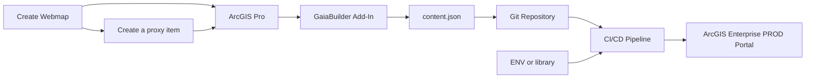
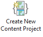
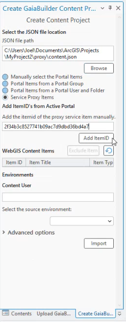

# Publishing an Service Proxy Item App

This guide builds on the steps described in [Publishing a Map Service](../Publishing%20a%20map%20service/README.md). This means there is already a webmap published in Portal.

In this section, you'll learn how to publish a service proxy item using your previously published map service. In this example, we use our own portal. However, this process can also apply to another portal, ArcGIS Online, or a DMZ portal.

## Prerequisites

### 🧠 Assumptions

You should be familiar with:

- Completing the steps outlined in [Publishing a Map Service](../Publishing%20a%20map%20service/README.md), as this guide builds upon that.
- Creating a service proxy configuration in Portal.
- Managing deployments through JSON configurations using GaiaBuilder.
- Using version control systems such as Git, Subversion, or Bitbucket.

Before starting, ensure you have:

- Access to the target Portal or ArcGIS Online using a service account or named user.

### Overview


# ✅ Step-by-Step Deployment Flow

### Step 1: Create the new Webmap

1. Log in to ArcGIS Enterprise Portal and create a new webmap and proxy service.
2. In our case we have verified our previously published map service is added as a data source and configured correctly.
3. Configure the Portal item Set:
* 🔖 Thumbnail
* 📄 Summary
* 🔗 Description
* 📜 Terms of use
* 🏷️ Tags and categories
4. Note down the FQDN (Fully Qualified Domain Name e.g. https://demo.gaiabuilder.com/service/rest/service/DEV/San_Diego_Letters_MIL1/MapServer) of the mapservice in the dev environment

### Step 2: Create a Service Proxy Item
1. Using the FQDN of the webmap create new item
2. Choose URL, and fill in the FQDN from the previous step
3. Check the `Store credentials with service iem. Do not prompt for authentication`
4. Click Next, and enter the username and password of the service principle or named user.
5. Configure the item Set:
* 📄 Title
* 📂 Folder
* 🏷️ Tags and categories
* 📜 Summary
6. Click Save
7. Note down the item-id of the service proxy URL

1. Use the GaiaBuilder Add-In to export your Experience Builder app configuration as JSON, including all related resources.
- 📁 **Set the location** for the `content.json` inside a Git-initialized or cloned folder.  
- 🆔 **Add the required item IDs** — in our example, we manually select the web map `itemId` and the Experience Builder `itemId`.  
- ✅ **Verify** that the web map and Experience Builder app are successfully listed in the overview.  
- 💡 **Environments** In our example, we did not uncheck the **Dev** environment, this can be amended by removing the `DEV` section under servers in a text editor, and  (see [Environments field reference](../../docs/Environments.md)), and then check that permissions, locks, and folder structure are set as needed for your deployment scenario.
- 🌍 **Select** **DEV** as the source environment.



<details><summary>Example GaiaBuilder Content Project Configuration</summary>


</details>

### Step 4: Adjust Configuration for Environment-Specific URL or Title Rewrites

1. Open the `content.json` configuration file in a text editor of your choice and inspect the rewrite rules applicable to the current deployment environment. In our example we moved the server configuration to a separate file `server.json` and referenced this in the content configuration `content.json` in the serverconfiguration attribute.

<details><summary>Example content.json Configuration</summary>

```json
{
  "action": "deployProxy",
  "contentSelect": 1,
  "sourcePortal": "https://demo.gaiabuilder.com/portal/",
  "sourceGroup": "",
  "sourceGroupId": "",
  "sourceFolder": "",
  "sourceFolderId": "",
  "sourceUser": "demo.professional.plus",
  "portalLogo": null,
  "portalFolder": "",
  "protected": "false",
  "content_status": "",
  "contentUser": "demo.professional.plus",
  "overwrite_existing": "false",
  "allow_layer_delete": "false",
  "allow_field_delete": "false",
  "serverconfiguration": "server.json",
  "items": [
    {
      "type": "Map Service",
      "title": "Service Proxy Demo",
      "name": "Service Proxy Demo",
      "itemId": "ec42bb6872af49e0bea29a565d0ed50f",
      "sourceServiceItemId": "",
      "descriptionjson": "ec42bb6872af49e0bea29a565d0ed50f.json",
      "datajson": "ec42bb6872af49e0bea29a565d0ed50f.data.json",
      "metadata": "",
      "datafile": "",
      "resourcejson": "ec42bb6872af49e0bea29a565d0ed50f.resources.json",
      "relationjson": "ec42bb6872af49e0bea29a565d0ed50f.relations.json",
      "servicejson": null,
      "servicewebhooks": null,
      "portalLogo": "",
      "rewrites": {
        "webUrl": "https://demo.gaiabuilder.com/server/rest/services/DEV"
      },
      "sourceUrl": "https://demo.gaiabuilder.com/portal/sharing/servers/ec42bb6872af49e0bea29a565d0ed50f/rest/services/DEV/San_Diego_Letters_MIL1/MapServer",
      "itemIdRewrites": [
        "ec42bb6872af49e0bea29a565d0ed50f"
      ],
      "categories": [],
      "sharing": null,
      "portalFolder": null
    }
  ],
  "excluded_items": []  
}
```

</details>
<details><summary>Example server.json Configuration</summary>

```json
{
  "servers": {
    "DEV": {
      "protected": "false",
      "rewrites": {},
      "portalLogo": "thumbnail_dev.png",
      "portalFolder": "dev",
      "content_status": null,
      "sharing": {
        "esriEveryone": "false",
        "organization": "false",
        "groups": [
          "Demo DEV"
        ]
      },
      "layersuffix": ""
    },
    "TEST": {
      "protected": "false",
      "rewrites": {
        "webUrl": "https://demo.gaiabuilder.com/server/rest/services/TEST"
      },
      "portalLogo": "thumbnail_test.png",
      "portalFolder": "test",
      "content_status": null,
      "sharing": {
        "esriEveryone": "false",
        "organization": "false",
        "groups": []
      },
      "layersuffix": ""
    },
    "ACC": {
      "protected": "false",
      "rewrites": {
        "webUrl": "https://demo.gaiabuilder.com/server/rest/services/ACC"
      },
      "portalLogo": "thumbnail_acc.png",
      "portalFolder": "acc",
      "content_status": null,
      "sharing": {
        "esriEveryone": "false",
        "organization": "false",
        "groups": []
      },
      "layersuffix": ""
    },
    "PROD": {
      "protected": "false",
      "rewrites": {
        "webUrl": "https://demo.gaiabuilder.com/server/rest/services/PROD"
      },
      "portalLogo": "thumbnail_prod.png",
      "portalFolder": "prod",
      "content_status": null,
      "sharing": {
        "esriEveryone": "false",
        "organization": "false",
        "groups": []
      },
      "layersuffix": ""
    }
  }
}
```

</details>

### Step 5: Commit and Push to Version Control

Store the JSON files in Git (or another VCS) for reproducible deployments and rollback support.

<details><summary>Example Files Stored in Git</summary>

📂 **Files stored in Git:**

📄 content.json
📄 ec42bb6872af49e0bea29a565d0ed50f.data.json
📄 ec42bb6872af49e0bea29a565d0ed50f.json
📄 ec42bb6872af49e0bea29a565d0ed50f.relations.json
📄 ec42bb6872af49e0bea29a565d0ed50f.resources.json
📄 server.json
📄 thumbnail_acc.png
📄 thumbnail_dev.png
📄 thumbnail_prod.png
📄 thumbnail_test.png

</details>

### Step 6: Integrate into Your CI/CD System

You can run GaiaBuilder in automation environments such as:

- GitHub Actions
- GitLab CI
- Jenkins
- Azure DevOps
- TeamCity
- Cron-based scripts

---

## 🚀 Generic Deployment Script (PowerShell)

The example below works on any runner or agent supporting PowerShell and Python (with Conda). It uses the content.json created ($env:manual_build_list) above, including the relative path and the environment name ($env:server) where you want to push it to [^1].

```powershell
& "$env:CondaHook"
conda activate "$env:CondaEnv_GaiaBuilder"

$scriptPath = "C:\GaiaBuilder\InstallContent_lite.py"

$args = @(
    "-f", $env:manual_build_list,   # Relative path to the JSON config file
    "-s", $env:server               # Server config name
)

python $scriptPath $args
```

### 🔐 Environment Variables

Securely set these values using your CI/CD environment's secret store, note that the GIS_PROXY_USER can differ from the deployment agent with access to the :

```yaml
env:
    USER: $(USER)
    PASSWORD: $(PASSWORD)
    GIS_PROXY_USER: $(GIS_PROXY_USER)
    GIS_PROXY_PASSWORD: $(GIS_PROXY_PASSWORD)
```

---

After deployment, verify your map service in the ArcGIS REST Services Directory or ArcGIS Pro Catalog before promoting to higher environments.

[^1]: ## 🧾 GaiaBuilder CLI Options
Detailed documentation for `InstallContent_lite` and its command-line options is available [here](https://github.com/merkator-software/GaiaBuilder-manual/wiki/InstallContentTool).
