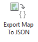
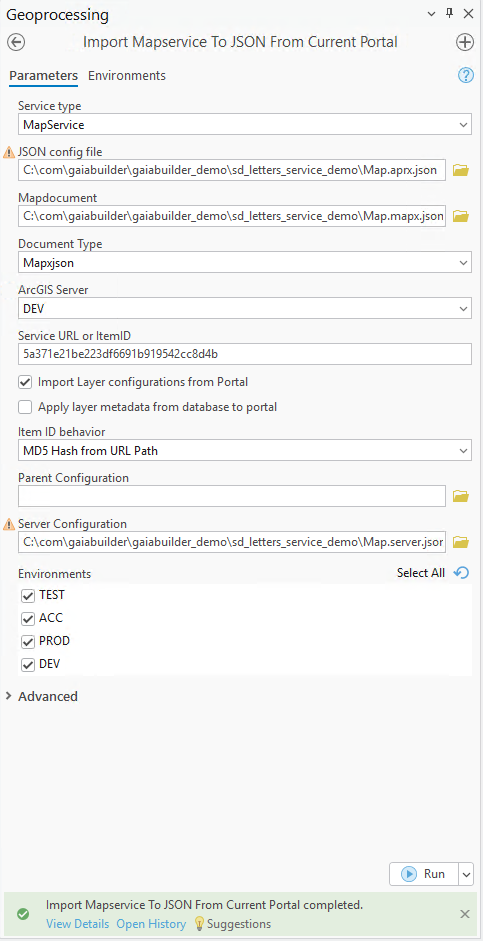

Publish a map service
=====================

### 🧠 Assumptions

You are an ArcGIS Pro user who knows how to:

* Publish a web service and web map
* Configure thumbnails, metadata, terms of use, and group sharing
* High level knowledge of GaiaBuilder to manage deployments through JSON
* Use version control systems like Git, Subversion or Bitbucket

---
### Overview

[ArcGIS Pro] → [GaiaBuilder Add-In] → [mapx.json] → [Git] → [CI/CD] → [Portal]

### ✅ Step-by-Step Deployment Flow

1. **Create your map in ArcGIS Pro**
   Design your layer symbology, labels, pop-ups, etc.

2. **Publish as Web Map to ArcGIS Portal**
   Use “Share as Web Map” to publish the map to your Portal.

3. **Configure the Portal item**
   Set:

   * 🔖 Thumbnail
   * 📄 Metadata
   * 📜 Terms of use
   * 👥 Group permissions
   * 🏷️ Tags and categories

4. **Export to GaiaBuilder JSON**

   Use the **GaiaBuilder Add-In** to export map and its metadata into a JSON configuration file, give this a .mapx.json name to illustrate this is the map without credentials, safe to store in a repro in a hardened environment
   
   

   * `Map.mapx.json`

   

<details>
<summary>Expand for example Map.mapx.json on our server</summary>

```json
{
  "type": "CIMMapDocument",
  "version": "3.5.0",
  "build": 57366,
  "mapDefinition": {
    "type": "CIMMap",
    "name": "Map",
    "uRI": "CIMPATH=Map/Map.json",
    "sourceModifiedTime": {
      "type": "TimeInstant"
    },
    "useSourceMetadata": true,
    "illumination": {
      "type": "CIMIlluminationProperties",
      "ambientLight": 50,
      "sunPositionX": -0.61237243569579,
      "sunPositionY": 0.61237243569579,
      "sunPositionZ": 0.5,
      "illuminationSource": "AbsoluteSunPosition",
      "sunAzimuth": 315,
      "sunAltitude": 30,
      "showStars": true,
      "enableAmbientOcclusion": true,
      "enableEyeDomeLighting": true
    },
    "layers": [
      "CIMPATH=Map/demo_dev_demo_LetterFeatures.json",
      "CIMPATH=1209e3bda550493bbe02cf3e1c360338.json",
      "CIMPATH=d0252534766f4509abfaad00ec2ed70f.json"
    ],
    "defaultViewingMode": "Map",
    "mapType": "Map",
    "groundElevationSurfaceLayer": "CIMPATH=Map/386d085ac5a44e329d6d4a59bf632773.json",
    "defaultColorVisionDeficiencyMode": "None",
    "defaultExtent": {
      "xmin": -13062150.218646975,
      "ymin": 3852563.511316471,
      "xmax": -13032218.02721397,
      "ymax": 3876478.7991280844,
      "spatialReference": {
        "wkid": 102100,
        "latestWkid": 3857,
        "xyTolerance": 0.001,
        "zTolerance": 0.001,
        "mTolerance": 0.001,
        "falseX": -20037700,
        "falseY": -30241100,
        "xyUnits": 10000,
        "falseZ": -100000,
        "zUnits": 10000,
        "falseM": -100000,
        "mUnits": 10000
      }
    },
    "generalPlacementProperties": {
      "type": "CIMMaplexGeneralPlacementProperties",
      "invertedLabelTolerance": 2,
      "unplacedLabelColor": {
        "type": "CIMRGBColor",
        "values": [
          255,
          0,
          0,
          100
        ]
      },
      "keyNumberGroups": [
        {
          "type": "CIMMaplexKeyNumberGroup",
          "delimiterCharacter": ".",
          "horizontalAlignment": "Left",
          "maximumNumberOfLines": 20,
          "minimumNumberOfLines": 2,
          "name": "Default",
          "numberResetType": "None",
          "keyNumberMethod": "PreventUnplacedLabels"
        }
      ],
      "placementQuality": "High"
    },
    "snappingProperties": {
      "type": "CIMSnappingProperties",
      "xYTolerance": 10,
      "xYToleranceUnit": "SnapXYToleranceUnitPixel",
      "snapToSketchEnabled": true,
      "snapRequestType": "SnapRequestType_GeometricAndVisualSnapping",
      "isZSnappingEnabled": true,
      "snapTipDisplayParts": 3
    },
    "spatialReference": {
      "wkid": 102100,
      "latestWkid": 3857,
      "xyTolerance": 0.001,
      "zTolerance": 0.001,
      "mTolerance": 0.001,
      "falseX": -20037700,
      "falseY": -30241100,
      "xyUnits": 10000,
      "falseZ": -100000,
      "zUnits": 10000,
      "falseM": -100000,
      "mUnits": 10000
    },
    "timeDisplay": {
      "type": "CIMMapTimeDisplay",
      "defaultTimeIntervalUnits": "esriTimeUnitsUnknown",
      "timeValue": {
        "type": "TimeExtent",
        "start": null,
        "end": null,
        "empty": false
      },
      "timeRelation": "esriTimeRelationOverlaps"
    },
    "colorModel": "RGB",
    "scaleDisplayFormat": "Value",
    "clippingMode": "None",
    "nearPlaneClipDistanceMode": "Automatic",
    "rGBColorProfile": "sRGB IEC61966-2.1",
    "cMYKColorProfile": "U.S. Web Coated (SWOP) v2",
    "autoFillFeatureCache": true,
    "useMasking": true
  },
  "layerDefinitions": [
    {
      "type": "CIMFeatureLayer",
      "name": "LetterFeatures",
      "uRI": "CIMPATH=Map/demo_dev_demo_LetterFeatures.json",
      "sourceModifiedTime": {
        "type": "TimeInstant",
        "start": -62135596800000
      },
      "metadataURI": "CIMPATH=Metadata/da3b0dc809edaaf35eb8bbe023fea56e.xml",
      "useSourceMetadata": true,
      "description": "demo_dev.demo.LetterFeatures",
      "layerElevation": {
        "type": "CIMLayerElevationSurface"
      },
      "expanded": true,
      "layer3DProperties": {
        "type": "CIM3DLayerProperties",
        "castShadows": true,
        "isLayerLit": true,
        "layerFaceCulling": "None",
        "maxDistance": -1,
        "minDistance": -1,
        "preloadTextureCutoffHigh": 0,
        "preloadTextureCutoffLow": 0.25,
        "textureCutoffHigh": 0.25,
        "textureCutoffLow": 1,
        "useCompressedTextures": true,
        "verticalExaggeration": 1,
        "exaggerationMode": "ScaleZ",
        "verticalUnit": {
          "uwkid": 9001
        },
        "lighting": "OneSideDataNormal",
        "optimizeMarkerTransparency": true
      },
      "layerType": "Operational",
      "showLegends": true,
      "visibility": true,
      "displayCacheType": "Permanent",
      "maxDisplayCacheAge": 5,
      "showPopups": true,
      "serviceLayerID": -1,
      "refreshRate": -1,
      "refreshRateUnit": "esriTimeUnitsSeconds",
      "blendingMode": "Alpha",
      "allowDrapingOnIntegratedMesh": true,
      "autoGenerateFeatureTemplates": true,
      "featureElevationExpression": "Shape.Z",
      "featureTable": {
        "type": "CIMFeatureTable",
        "displayField": "name",
        "editable": true,
        "dataConnection": {
          "type": "CIMStandardDataConnection",
          "workspaceConnectionString": "demo",
          "workspaceFactory": "SDE",
          "dataset": "demo_dev.demo.LetterFeatures",
          "datasetType": "esriDTFeatureClass"
        },
        "studyAreaSpatialRel": "esriSpatialRelUndefined",
        "searchOrder": "esriSearchOrderSpatial"
      },
      "featureTemplates": [
        {
          "type": "CIMRowTemplate",
          "name": "LetterFeatures",
          "defaultValues": {
            "type": "PropertySet",
            "propertySetItems": []
          }
        }
      ],
      "htmlPopupEnabled": true,
      "selectable": true,
      "featureCacheType": "Session",
      "displayFiltersType": "ByScale",
      "featureBlendingMode": "Alpha",
      "layerEffectsMode": "Layer",
      "labelClasses": [
        {
          "type": "CIMLabelClass",
          "expressionTitle": "Custom",
          "expression": "$feature.name",
          "expressionEngine": "Arcade",
          "featuresToLabel": "AllVisibleFeatures",
          "maplexLabelPlacementProperties": {
            "type": "CIMMaplexLabelPlacementProperties",
            "featureType": "Polygon",
            "avoidPolygonHoles": true,
            "canOverrunFeature": true,
            "canPlaceLabelOutsidePolygon": true,
            "canRemoveOverlappingLabel": true,
            "canStackLabel": true,
            "centerLabelAnchorType": "Symbol",
            "connectionType": "Unambiguous",
            "constrainOffset": "NoConstraint",
            "contourAlignmentType": "Page",
            "contourLadderType": "Straight",
            "contourMaximumAngle": 90,
            "enableConnection": true,
            "featureWeight": 0,
            "fontHeightReductionLimit": 4,
            "fontHeightReductionStep": 0.5,
            "fontWidthReductionLimit": 90,
            "fontWidthReductionStep": 5,
            "graticuleAlignmentType": "Straight",
            "keyNumberGroupName": "Default",
            "labelBuffer": 15,
            "labelLargestPolygon": true,
            "labelPriority": -1,
            "labelStackingProperties": {
              "type": "CIMMaplexLabelStackingProperties",
              "stackAlignment": "ChooseBest",
              "maximumNumberOfLines": 3,
              "minimumNumberOfCharsPerLine": 3,
              "maximumNumberOfCharsPerLine": 24,
              "separators": [
                {
                  "type": "CIMMaplexStackingSeparator",
                  "separator": " ",
                  "splitAfter": true
                },
                {
                  "type": "CIMMaplexStackingSeparator",
                  "separator": ",",
                  "visible": true,
                  "splitAfter": true
                }
              ],
              "trimStackingSeparators": true,
              "preferToStackLongLabels": true
            },
            "lineFeatureType": "General",
            "linePlacementMethod": "OffsetCurvedFromLine",
            "maximumLabelOverrun": 80,
            "maximumLabelOverrunUnit": "Point",
            "measureFromClippedFeatureGeometry": true,
            "minimumFeatureSizeUnit": "Map",
            "multiPartOption": "OneLabelPerPart",
            "offsetAlongLineProperties": {
              "type": "CIMMaplexOffsetAlongLineProperties",
              "placementMethod": "BestPositionAlongLine",
              "labelAnchorPoint": "CenterOfLabel",
              "distanceUnit": "Percentage",
              "useLineDirection": true
            },
            "pointExternalZonePriorities": {
              "type": "CIMMaplexExternalZonePriorities",
              "aboveLeft": 4,
              "aboveCenter": 2,
              "aboveRight": 1,
              "centerRight": 3,
              "belowRight": 5,
              "belowCenter": 7,
              "belowLeft": 8,
              "centerLeft": 6
            },
            "pointPlacementMethod": "AroundPoint",
            "polygonAnchorPointType": "GeometricCenter",
            "polygonBoundaryWeight": 0,
            "polygonExternalZones": {
              "type": "CIMMaplexExternalZonePriorities",
              "aboveLeft": 4,
              "aboveCenter": 2,
              "aboveRight": 1,
              "centerRight": 3,
              "belowRight": 5,
              "belowCenter": 7,
              "belowLeft": 8,
              "centerLeft": 6
            },
            "polygonFeatureType": "General",
            "polygonInternalZones": {
              "type": "CIMMaplexInternalZonePriorities",
              "center": 1
            },
            "polygonPlacementMethod": "HorizontalInPolygon",
            "primaryOffset": 1,
            "primaryOffsetUnit": "Point",
            "removeAmbiguousLabels": "All",
            "removeExtraWhiteSpace": true,
            "repetitionIntervalUnit": "Point",
            "rotationProperties": {
              "type": "CIMMaplexRotationProperties",
              "rotationType": "Arithmetic",
              "alignmentType": "Straight"
            },
            "secondaryOffset": 100,
            "secondaryOffsetUnit": "Percentage",
            "strategyPriorities": {
              "type": "CIMMaplexStrategyPriorities",
              "stacking": 1,
              "overrun": 2,
              "fontCompression": 3,
              "fontReduction": 4,
              "abbreviation": 5
            },
            "thinningDistanceUnit": "Point",
            "truncationMarkerCharacter": ".",
            "truncationMinimumLength": 1,
            "truncationPreferredCharacters": "aeiou",
            "truncationExcludedCharacters": "0123456789",
            "polygonAnchorPointPerimeterInsetUnit": "Point"
          },
          "name": "Class 1",
          "priority": -1,
          "standardLabelPlacementProperties": {
            "type": "CIMStandardLabelPlacementProperties",
            "featureType": "Line",
            "featureWeight": "None",
            "labelWeight": "High",
            "numLabelsOption": "OneLabelPerName",
            "lineLabelPosition": {
              "type": "CIMStandardLineLabelPosition",
              "above": true,
              "inLine": true,
              "parallel": true
            },
            "lineLabelPriorities": {
              "type": "CIMStandardLineLabelPriorities",
              "aboveStart": 3,
              "aboveAlong": 3,
              "aboveEnd": 3,
              "centerStart": 3,
              "centerAlong": 3,
              "centerEnd": 3,
              "belowStart": 3,
              "belowAlong": 3,
              "belowEnd": 3
            },
            "pointPlacementMethod": "AroundPoint",
            "pointPlacementPriorities": {
              "type": "CIMStandardPointPlacementPriorities",
              "aboveLeft": 2,
              "aboveCenter": 2,
              "aboveRight": 1,
              "centerLeft": 3,
              "centerRight": 2,
              "belowLeft": 3,
              "belowCenter": 3,
              "belowRight": 2
            },
            "rotationType": "Arithmetic",
            "polygonPlacementMethod": "AlwaysHorizontal"
          },
          "textSymbol": {
            "type": "CIMSymbolReference",
            "symbol": {
              "type": "CIMTextSymbol",
              "blockProgression": "TTB",
              "depth3D": 1,
              "extrapolateBaselines": true,
              "fontEffects": "Normal",
              "fontEncoding": "Unicode",
              "fontFamilyName": "Tahoma",
              "fontStyleName": "Regular",
              "fontType": "Unspecified",
              "haloSize": 1,
              "height": 10,
              "hinting": "Default",
              "horizontalAlignment": "Left",
              "kerning": true,
              "letterWidth": 100,
              "ligatures": true,
              "lineGapType": "ExtraLeading",
              "symbol": {
                "type": "CIMPolygonSymbol",
                "symbolLayers": [
                  {
                    "type": "CIMSolidFill",
                    "enable": true,
                    "color": {
                      "type": "CIMRGBColor",
                      "values": [
                        0,
                        0,
                        0,
                        100
                      ]
                    }
                  }
                ],
                "angleAlignment": "Map"
              },
              "textCase": "Normal",
              "textDirection": "LTR",
              "verticalAlignment": "Bottom",
              "verticalGlyphOrientation": "Right",
              "wordSpacing": 100,
              "billboardMode3D": "FaceNearPlane"
            }
          },
          "useCodedValue": true,
          "visibility": true,
          "iD": -1
        }
      ],
      "renderer": {
        "type": "CIMSimpleRenderer",
        "sampleSize": 10000,
        "patch": "Default",
        "symbol": {
          "type": "CIMSymbolReference",
          "symbol": {
            "type": "CIMPolygonSymbol",
            "symbolLayers": [
              {
                "type": "CIMSolidStroke",
                "enable": true,
                "capStyle": "Round",
                "joinStyle": "Round",
                "lineStyle3D": "Strip",
                "miterLimit": 10,
                "width": 0.7,
                "height3D": 1,
                "anchor3D": "Center",
                "color": {
                  "type": "CIMRGBColor",
                  "values": [
                    110,
                    110,
                    110,
                    100
                  ]
                }
              },
              {
                "type": "CIMSolidFill",
                "enable": true,
                "color": {
                  "type": "CIMRGBColor",
                  "values": [
                    214.58,
                    252.45,
                    252.45,
                    100
                  ]
                }
              }
            ],
            "angleAlignment": "Map"
          }
        }
      },
      "scaleSymbols": true,
      "snappable": true
    },
    {
      "type": "CIMVectorTileLayer",
      "name": "World Topographic Map",
      "uRI": "CIMPATH=1209e3bda550493bbe02cf3e1c360338.json",
      "sourceModifiedTime": {
        "type": "TimeInstant"
      },
      "useSourceMetadata": true,
      "layerType": "BasemapBackground",
      "showLegends": true,
      "visibility": true,
      "displayCacheType": "Permanent",
      "maxDisplayCacheAge": 5,
      "showPopups": true,
      "serviceLayerID": -1,
      "refreshRate": -1,
      "refreshRateUnit": "esriTimeUnitsSeconds",
      "webMapLayerID": "VectorTile_2333",
      "blendingMode": "Alpha",
      "allowDrapingOnIntegratedMesh": false,
      "dataConnection": {
        "type": "CIMVectorTileDataConnection",
        "uRI": "https://cdn.arcgis.com/sharing/rest/content/items/7dc6cea0b1764a1f9af2e679f642f0f5/resources/styles/root.json"
      }
    },
    {
      "type": "CIMTiledServiceLayer",
      "name": "World Hillshade",
      "uRI": "CIMPATH=d0252534766f4509abfaad00ec2ed70f.json",
      "sourceModifiedTime": {
        "type": "TimeInstant"
      },
      "useSourceMetadata": true,
      "description": "Elevation/World_Hillshade",
      "layerType": "BasemapBackground",
      "showLegends": true,
      "visibility": true,
      "displayCacheType": "Permanent",
      "maxDisplayCacheAge": 5,
      "showPopups": true,
      "serviceLayerID": -1,
      "refreshRate": -1,
      "refreshRateUnit": "esriTimeUnitsSeconds",
      "webMapLayerID": "World_Hillshade_3805",
      "blendingMode": "Alpha",
      "allowDrapingOnIntegratedMesh": false,
      "serviceConnection": {
        "type": "CIMAGSServiceConnection",
        "objectName": "Elevation/World_Hillshade",
        "objectType": "MapServer",
        "url": "https://services.arcgisonline.com/arcgis/rest/services/Elevation/World_Hillshade/MapServer",
        "serverConnection": {
          "type": "CIMInternetServerConnection",
          "anonymous": true,
          "hideUserProperty": true,
          "url": "https://services.arcgisonline.com/arcgis/services"
        }
      },
      "transparentColor": {
        "type": "CIMRGBColor",
        "values": [
          254,
          254,
          254,
          100
        ]
      },
      "backgroundColor": {
        "type": "CIMRGBColor",
        "values": [
          254,
          254,
          254,
          100
        ]
      }
    }
  ],
  "binaryReferences": [
    {
      "type": "CIMBinaryReference",
      "uRI": "CIMPATH=Metadata/da3b0dc809edaaf35eb8bbe023fea56e.xml",
      "data": "<?xml version=\"1.0\"?>\r\n<metadata xml:lang=\"en\">\r\n\t<Esri>\r\n\t\t<CreaDate>20250612</CreaDate>\r\n\t\t<CreaTime>02230200</CreaTime>\r\n\t\t<ArcGISFormat>1.0</ArcGISFormat>\r\n\t\t<SyncOnce>TRUE</SyncOnce>\r\n\t</Esri>\r\n</metadata>\r\n"
    }
  ],
  "elevationSurfaceLayerDefinitions": [
    {
      "type": "CIMElevationSurfaceLayer",
      "name": "Ground",
      "uRI": "CIMPATH=Map/386d085ac5a44e329d6d4a59bf632773.json",
      "sourceModifiedTime": {
        "type": "TimeInstant"
      },
      "useSourceMetadata": true,
      "description": "Ground",
      "expanded": true,
      "layer3DProperties": {
        "type": "CIM3DLayerProperties",
        "castShadows": true,
        "isLayerLit": true,
        "layerFaceCulling": "None",
        "preloadTextureCutoffHigh": 0.3,
        "preloadTextureCutoffLow": 0.6,
        "textureCutoffHigh": 0.3,
        "textureCutoffLow": 0.6,
        "useCompressedTextures": true,
        "verticalExaggeration": 1,
        "exaggerationMode": "ScaleZ",
        "lighting": "OneSideDataNormal",
        "optimizeMarkerTransparency": true
      },
      "layerType": "Operational",
      "showLegends": false,
      "visibility": true,
      "displayCacheType": "Permanent",
      "maxDisplayCacheAge": 5,
      "showPopups": true,
      "serviceLayerID": -1,
      "refreshRate": -1,
      "refreshRateUnit": "esriTimeUnitsSeconds",
      "blendingMode": "Alpha",
      "allowDrapingOnIntegratedMesh": true,
      "elevationMode": "BaseGlobeSurface",
      "verticalExaggeration": 1,
      "color": {
        "type": "CIMRGBColor",
        "values": [
          255,
          255,
          255,
          100
        ]
      },
      "surfaceTINShadingMode": "Smooth"
    }
  ]
}
```

</details>

5. **Import service configuration**
   This allows GaiaBuilder to recreate or sync services in other environments from the exported JSON. 

   

   ⚠️ Caution: Importing will overwrite any manual changes made outside of GaiaBuilder. Only use if this environment is fully managed through JSON.

<Details><Summary>Example configuration for virtual DTAP environment strategy.</Summary>


</Details>

6. **Apply MD5 hash (for OTAP)**
   Required when your OTAP environments (Test, Acceptance, Production) share the same ArcGIS Portal instance.
   Optional if each environment has its own dedicated Portal.

7. **Configure server settings**
   Use `GaiaBuilder.ini` to specify server URLs, connection credentials in the Connections folder using fully configured .ags files, and service directories/portals per environment on the server, this guides assumed this is configured correctly.

8. **(Optional) Edit server configuration manually**
   For advanced scenarios, edit the server JSON directly to override publishing behavior.
<details>
<summary>Expand for example Map.Server.json on our server</summary>

```json
{
    "servers": {
        "ACC": {
            "serverFolder": "ACC",
            "portalFolder": "ACC",
            "datasources": [
                {
                    "databasehint": "demo_acc"
                }
            ],
            "sharing": {
                "esriEveryone": "false",
                "groups": ["Demo ACC"],
                "organization": "false"
            },
            "sharingFeatureService": {
                "esriEveryone": "false",
                "groups": ["Demo ACC"],
                "organization": "false"
            }
        },
        "DEV": {
            "serverFolder": "DEV",
            "portalFolder": "DEV",
            "datasources": [
                {
                    "databasehint": "demo_dev"
                }
            ],
            "sharing": {
                "esriEveryone": "false",
                "groups": ["Demo DEV"],
                "organization": "false"
            },
            "sharingFeatureService": {
                "esriEveryone": "false",
                "groups": ["Demo DEV"],
                "organization": "false"
            }
        },
        "PROD": {
            "serverFolder": "PROD",
            "portalFolder": "PROD",
            "datasources": [
                {
                    "databasehint": "demo_prod"
                }
            ],
            "sharing": {
                "esriEveryone": "false",
                "groups": ["Demo PROD"],
                "organization": "false"
            },
            "sharingFeatureService": {
                "esriEveryone": "false",
                "groups": ["Demo PROD"],
                "organization": "false"
            }
        },
        "TEST": {
            "serverFolder": "TEST",
            "portalFolder": "TEST",
            "datasources": [
                {
                    "databasehint": "demo_test"
                }
            ],
            "sharing": {
                "esriEveryone": "false",
                "groups": ["Demo TEST"],
                "organization": "false"
            },
            "sharingFeatureService": {
                "esriEveryone": "false",
                "groups": ["Demo TEST"],
                "organization": "false"
            }
        }
    }
}
```
</details>

9. **Commit and push to version control**
   Store the JSON files in Git (or other VCS) for reproducible deployments and rollback support.

   * `5a371e21be223df6691b919542cc8d4b.data.json`
   * `Map.aprx.json`
   * `Map.mapx.json`
   * `Map.Server.json`
   * `thumbnail.PNG`

10. **Integrate into your CI/CD system**
    You can run GaiaBuilder in any automation environment:

* GitHub Actions
* GitLab CI
* Jenkins
* Azure DevOps
* TeamCity
* Cron-based scripts

---

## 🧪 Generic Deployment Script (PowerShell)

This example works on any runner or agent that supports PowerShell and Python (with Conda):

```powershell
& "$env:CondaHook"
conda activate "$env:CondaEnv_GaiaBuilder"

$scriptPath = "C:\GaiaBuilder\InstallMapservice_lite.py"

$args = @(
  "-f", $env:manual_build_list,   # JSON list of services to publish
  "-s", $env:server,              # Target server name or URL
  "-r", "false",                  # Restart ArcGIS Server (default: false)
  "-q", "true",                   # Quiet mode (suppress verbose output)
  "-c", "true",                   # Clean temp files
  "-d", "false",                  # Debug output (true/false)
  "-h", "true",                   # Enable MD5 hashing
  "-i", "true",                   # Import service configuration
  "-a", "true",                   # Apply metadata
  "-z", "true",                   # Zip final build
  "-m", "true",                   # Move zipped files to output location
  "-t", "false"                   # Test mode (true = dry-run)
)

python $scriptPath $args
```

### 🔐 Environment Variables

Set these values securely in your CI/CD system:

```yaml
env:
  USER: $(USER)
  PASSWORD: $(PASSWORD)
```

---

## 🧾 GaiaBuilder CLI Options – Summary

| Flag | Description                                          |
| ---- | ---------------------------------------------------- |
| `-f` | Input: JSON file with list of services to deploy     |
| `-s` | ArcGIS Server URL or identifier                      |
| `-r` | Restart ArcGIS service after deploy (default: false) |
| `-q` | Quiet mode (minimal output)                          |
| `-c` | Clean build directories                              |
| `-d` | Debug output                                         |
| `-h` | Generate MD5 hash                                    |
| `-i` | Import configuration from JSON                       |
| `-a` | Apply metadata (title, description, groups)          |
| `-z` | Zip output                                           |
| `-m` | Move zip to publish location                         |
| `-t` | Test mode (simulate deployment)                      |


---
After deployment, verify your map service in the ArcGIS REST Services Directory or ArcGIS Pro Catalog before promoting to higher environments.

