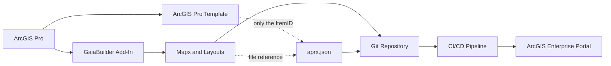
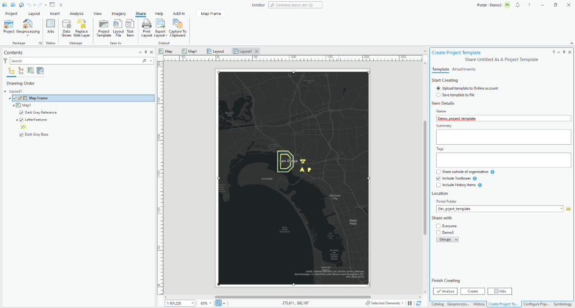
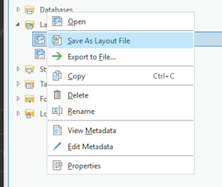
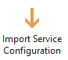
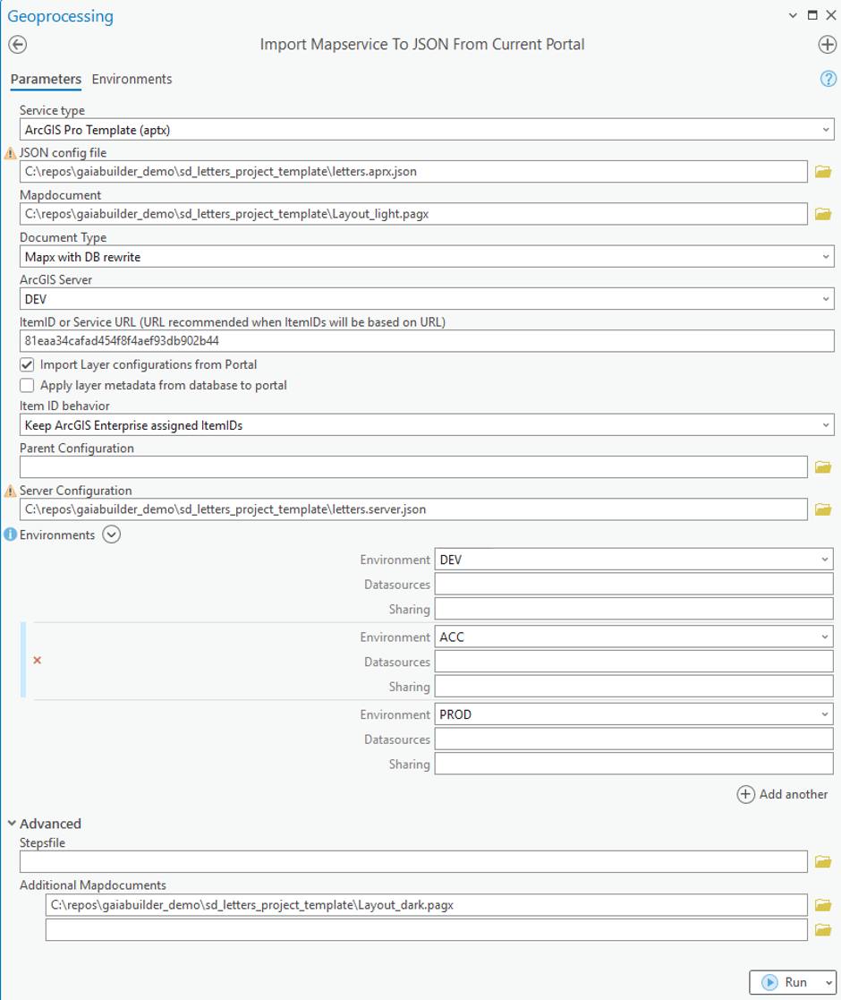

ArcGIS Pro Template (aptx) to Portal
==================

### 🧠 Assumptions

You are an ArcGIS Pro user who knows how to:

* Share an ArcGIS Pro Template (aptx)
* Configure thumbnails, metadata, terms of use, and group sharing
* High level knowledge of GaiaBuilder to manage deployments through JSON
* Use version control systems like Git, Subversion or Bitbucket

---
### Overview



### ✅ Step-by-Step Deployment Flow

1. **Create your maps and layouts in ArcGIS Pro**

   For ArcGIS Pro templates, you can include multiple maps and layouts into one template. Prepare all the maps and templates you'd need in your project. 
   You can include python toolboxes and Tasks items as well

2. **Package your Pro template to the DEV Portal**

   Use ArcGIS Pro Share Ribbon -> Project Template to share the template to you Development Portal

<details>
<summary>Expand to see the example Share Project Template in ArcGIS Pro</summary>



</details>

3. **Configure the Portal item**
   
   Set:
   * 🔖 Thumbnail
   * 📄 Title
   * 🔗 Description
   * 🏷️Summary
   * 📜 Terms of use
   * 👥 Group permissions
   * 🏷️ Tags and categories

5. **Export to GaiaBuilder JSON**

   When you have layouts in your project, export them using the Catalog view in Pro to your GIT repository, please note that this process won't remove database credentials during the process and we strongly recommend using data from Services instead to avoid databasecredentials. When the layouts contain one or more maps, these maps are exported with the layout and don't need to be exported separately.

   

   Use the **GaiaBuilder Add-In** to export the standalone maps to export the maps to your GIT repository. When your map contains database credentials, use Export map to JSON, otherwise use Export Mapx to save these maps. 

6. **Export the template aprx (option)**

   To ensure the Python toolboxes, Tasks and other items that cannot be exported to JSON are carried over, you can export the current APRX to GIT. Before you do this, __remove the Maps, Layouts and Geoprocessing History from the Pro Project__, then save the aprx file into the same GIT directory where the Maps and Layouts are saved

7. **Import service configuration**

   Run Import Service configuration to save all the portal configurations and deploy properties to JSON

   

   Whether you select a Mapx or a Pagx as the Mapdocument, you'll have to select Mapx with DB rewrite to ensure the URLS will be updated using the rewrites.

   If you have more than one Mapx or Pagx, expand the advanced section and provide the additional Maps and Layouts as Additional Mapdocuments

   Ensure that the input ArcGIS Server is listed as one of the output Environments to grab the default rewrites for each environment

   Choose Keep ArcGIS Enterprise assigned itemIDs (for DTAP) when your DTAP environments (Test, Acceptance, Production) share the same ArcGIS Portal instance.

   Optional if each environment has its own dedicated Portal, then you can select Keep ItemIDs from source, to keep the same itemID across environments.

  ⚠️ Note: MD5 Hash from URL Path is not available for templates, since the templates doesn't contain a URL property to derive the new itemid from

<Details><Summary>Example configuration for virtual DTAP environment strategy.</Summary>



</Details>
   
8. **(Optional) Edit server configuration manually**

   When you opted to use a custom input aprx at step 6, include a reference to this file in the JSON:

   ```json
   "templateaprx": "template.aprx",
   ```

   For ArcGIS Pro template files it is essential to change the template file name OR the portal folder when using a DTAP shares the same portal instance, in our example each server environment gets a unique foldername.

<Details>
<Summary>Expand to see example letters.Server.json on our server</Summary>

```json
{
    "servers": {
        "ACC": {
            "portalFolder": "Acc_prject_template",
            "datasources": [],
            "rewrite_outputs": {
                "environmentRewrite": "--ACC--",
                "webUrl": "https://demo.gaiabuilder.com/server/rest/services/ACC"
            },
            "sharing": {
                "esriEveryone": "false",
                "groups": [],
                "organization": "false"
            }
        },
        "PROD": {
            "datasources": [],
            "portalFolder": "Prod_prject_template",
            "rewrite_outputs": {
                "environmentRewrite": "--PROD--",
                "webUrl": "https://demo.gaiabuilder.com/server/rest/services/PROD"
            },
            "sharing": {
                "esriEveryone": "false",
                "groups": [],
                "organization": "true"
            }
        },
        "TEST": {
            "datasources": [],
            "portalFolder": "Test_prject_template",
            "rewrite_outputs": {
                "environmentRewrite": "--TEST--",
                "webUrl": "https://demo.gaiabuilder.com/server/rest/services/TEST"
            },
            "sharing": {
                "esriEveryone": "false",
                "groups": [],
                "organization": "false"
            }
        }
    }
}
```
</Details>

9. **Commit and push to version control**

   Store the JSON files in Git (or other VCS) for reproducible deployments and rollback support.

<Details><Summary>List of the files stored in git on our environment</Summary>

* 📄 layout_dark.pagx
* 📄 layout_light.pagx
* 📄 letters.aprx.json
* 📄 letters.server.json
* 📄 template.aprx
* 📄 thumbnail.png

</Details>

10. **Integrate into your CI/CD system**

    You can run GaiaBuilder in any automation environment:

* GitHub Actions
* GitLab CI
* Jenkins
* Azure DevOps
* TeamCity
* Cron-based scripts

---

## 🧪 Generic Deployment Script (PowerShell)

This example works on any runner or agent that supports PowerShell and Python (with Conda) [^1]:

```powershell
& "$env:CondaHook"
conda activate "$env:CondaEnv_GaiaBuilder"

$scriptPath = "C:\GaiaBuilder\InstallMapservice_lite.py"

$args = @(
  "-f", $env:manual_build_list,   # Required: Relative path to the JSON config file (MapService definition)
  "-s", $env:server,              # Required: Server config name from JSON / global INI
  "-r", "false",                  # Optional (default true): Replace datasources
  "-q", "true",                   # Optional (default false): Restore .mapx.json to .mapx (use with -m true and -r false)
  "-c", "true",                   # Optional (default true): Create aptx file
  "-a", "true",                   # Optional (default true): Configure service from JSON
  "-m", "true",                   # Optional (default false): Import .mapx into empty ArcGIS Pro project
)

python $scriptPath $args
```

### 🔐 Environment Variables
The -u and -p arguments are not safe to use in most CI environments and are intended for standalone use only.
Instead, set these values securely using your CI/CD environment's secret store. As of version 3.11, you can use either `USER` and `PASSWORD` for authentication. See [Security Best Practices](../../docs/Security-Best-Practices.md) for details.
```yaml
env:
  USER: $(USER)
  PASSWORD: $(PASSWORD)
```

This ensures your credentials do not appear in logs or version control.

---

[^1]: ## 🧾 GaiaBuilder CLI Options
InstallMapserviceTool and the light version (without an arcpy dependency) command line options are documented [here](https://github.com/merkator-software/GaiaBuilder-manual/wiki/InstallMapserviceTool)


