Publish an image service
=====================

### 🧠 Assumptions

You are an ArcGIS Pro user who knows how to:

* Publish a web service and web map
* Configure thumbnails, metadata, terms of use, and group sharing
* High level knowledge of GaiaBuilder to manage deployments through JSON
* Use version control systems like Git, Subversion or Bitbucket

---
### Overview

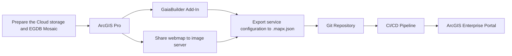

### ✅ Step-by-Step Deployment Flow

1. **Prepare the system**

    Create a UNC networkshare and mount it locally and configure it in ArcGIS Pro

    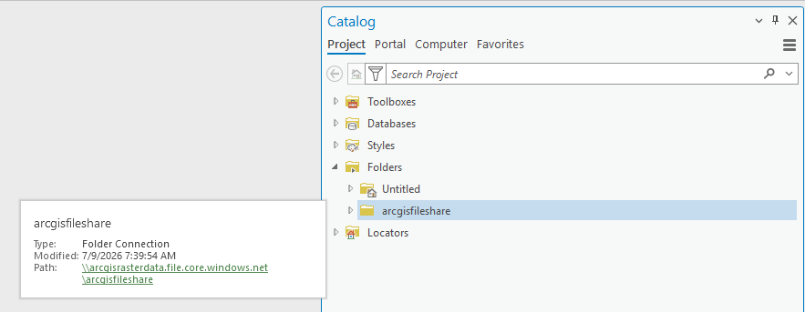

    Register the UNC networkshare on your ArcGIS Server (in this example the Hosting ArcGIS Server is also licensed as Image Server):

    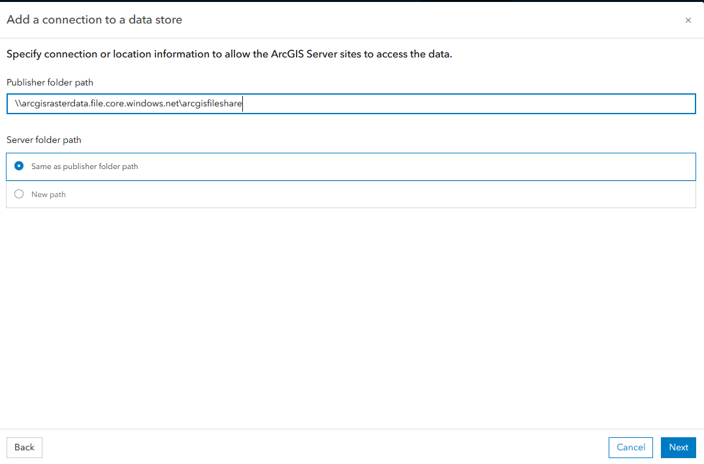
    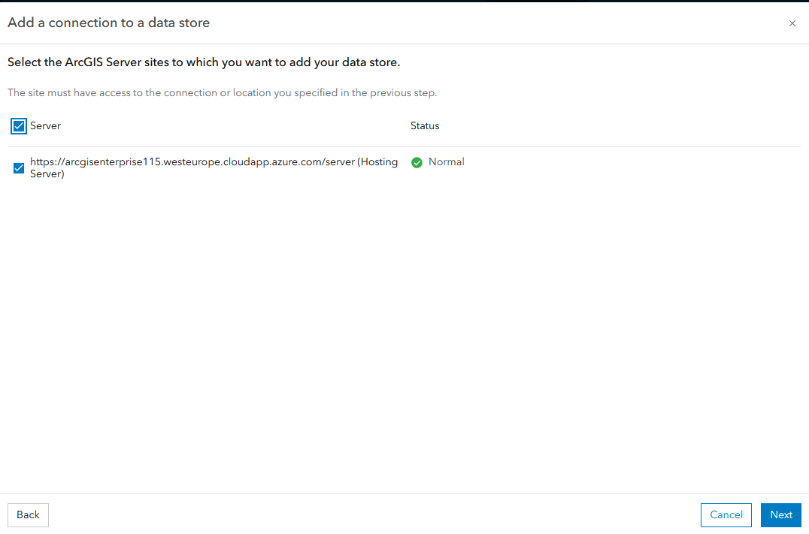
    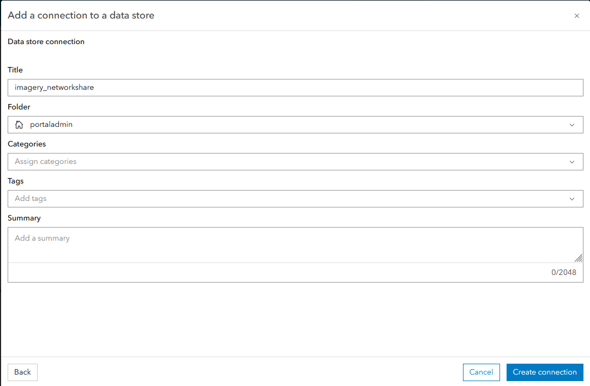

    Create the ACS Connection file(s) and copy it to the Network Share

    Create the SDE Connection file(s) and copy it to the Network Share

    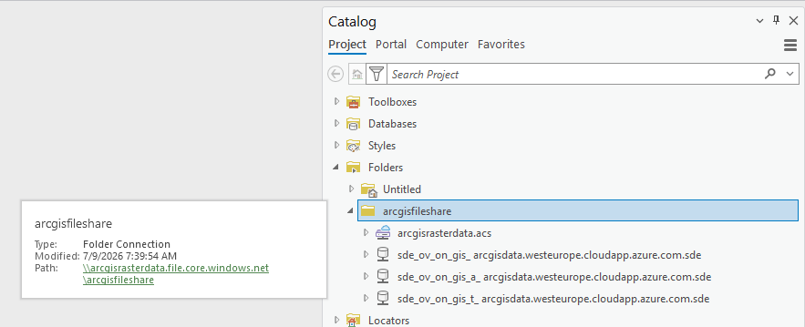

2. **Create the Mosaic and load the data**

    Create the Mosaic using the SDE file in the EGDB

    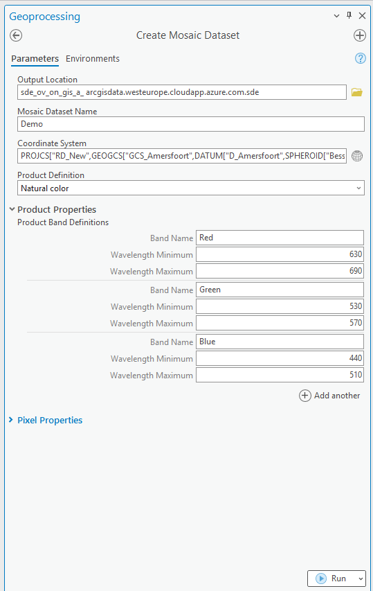

    Add the rasters to the Mosaic, ensure you're using the ACS file from the networkshare

    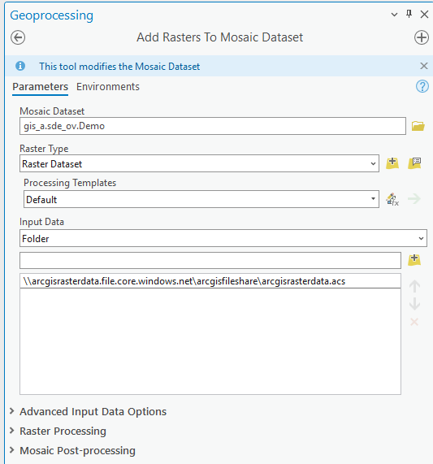


3. **Create your image map in ArcGIS Pro**

    Share the Mosaic as a Image Service in your Portal. Right click the Mosaic in the SDE connection and choose Share as Web Layer

    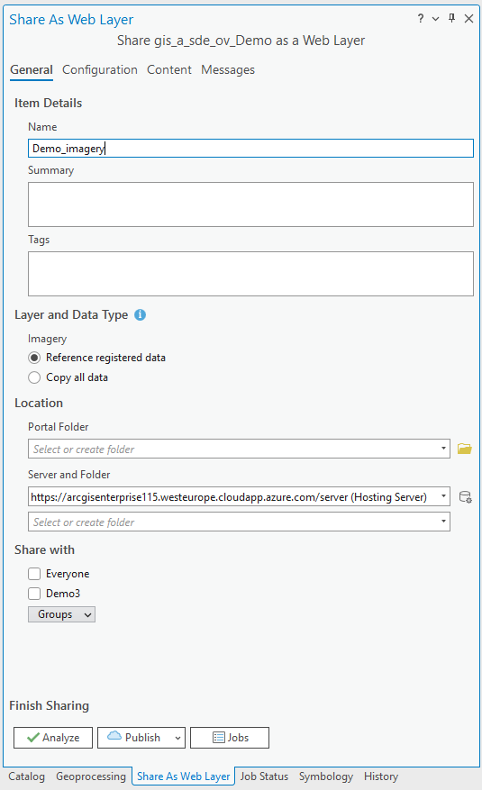

4. **Configure the Portal item**

   Set:
   * 🔖 Thumbnail
   * 📄 Title
   * 🔗 Description
   * 🏷️ Summary
   * ©️  Attribution
   * 📜 Terms of use
   * 👥 Group permissions
   * 🏷️ Tags and categories


5. **Import service configuration**

   This allows GaiaBuilder to recreate or sync services in other environments from the exported JSON. 
   
   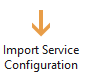

   - Choose ImageService in the Service type dropdown
   - Provide the full path of the Mosaic dataset in your EGDB using the SDE file in the Image Data Path parameter

   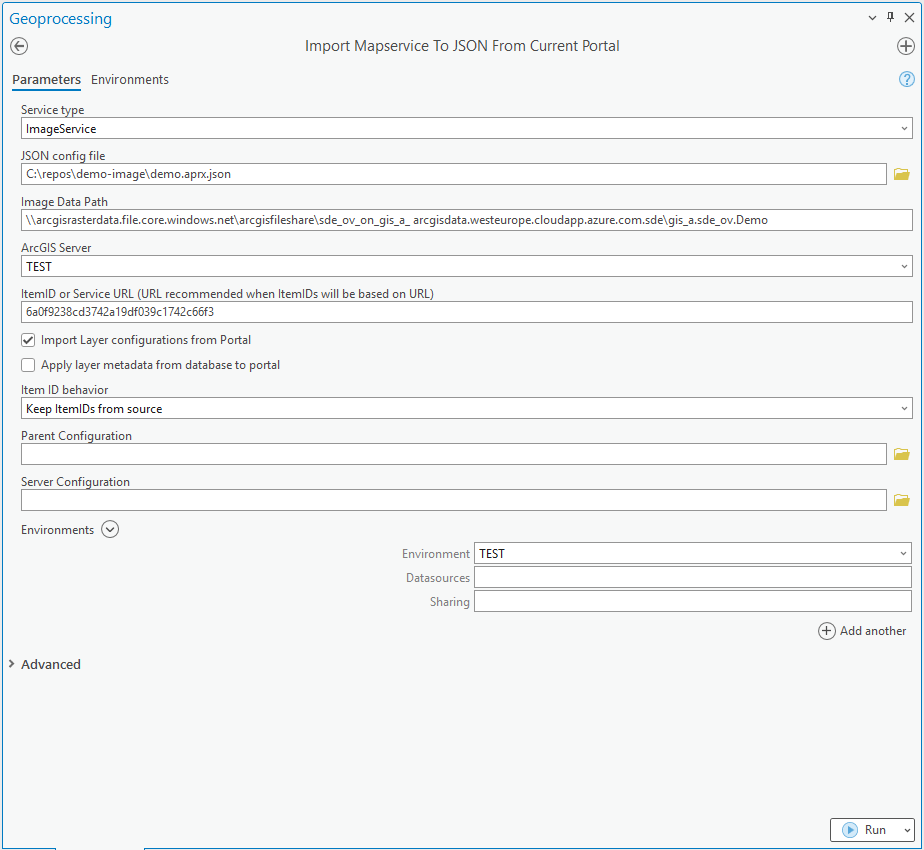
   
   >⚠️ Caution: Importing will overwrite any manual changes made outside of GaiaBuilder. Only use if this environment is fully managed through JSON.


6. **Apply MD5 hash (for DTAP)**

   Required when your DTAP environments (Test, Acceptance, Production) share the same ArcGIS Portal instance.
   Optional if each environment has its own dedicated Portal.

7. **(Optional) Edit server configuration manually**

   For advanced scenarios, edit the server JSON directly to override publishing behavior.

<Details>
<Summary>Expand for example Server.json</Summary>

```json
{
    "servers": {

        "ACC_IMAGE": {
            "portalFolder": "acc",
            "serverFolder": "ACC",
            "datasources": [],
            "sharing": {
                "esriEveryone": "false",
                "groups": [
                    "Demo ACC"
                ],
                "organization": "false"
            }
        },
        "DEV_IMAGE": {
            "portalFolder": "dev",
            "serverFolder": "DEV",
            "datasources": [],
            "sharing": {
                "esriEveryone": "false",
                "groups": [
                    "Demo DEV"
                ],
                "organization": "false"
            }
        },
        "PROD_IMAGE": {
            "portalFolder": "prod",
            "serverFolder": "PROD",
            "datasources": [],
            "sharing": {
                "esriEveryone": "false",
                "groups": [
                    "Demo PROD"
                ],
                "organization": "false"
            }
        },
        "TEST_IMAGE": {
            "portalFolder": "test",        
            "serverFolder": "TEST",
            "datasources": [],
            "sharing": {
                "esriEveryone": "false",
                "groups": [
                    "Demo TEST"
                ],
                "organization": "false"
            }
        }
    }
}
```
</Details>

8. **Commit and push to version control**

   Store the JSON files in Git (or other VCS) for reproducible deployments and rollback support.

   <Details><Summary>List of the files stored in git on our environment</Summary>

   * `5a371e21be223df6691b919542cc8d4b.data.json`
   * `Map.aprx.json`
   * `Map.Server.json`
   * `thumbnail.PNG`
</Details>

9. **Integrate into your CI/CD system**

    You can run GaiaBuilder in any automation environment:

* GitHub Actions
* GitLab CI
* Jenkins
* Azure DevOps
* TeamCity
* Cron-based scripts

---

## 🧪 Generic Deployment Script (PowerShell)

This example works on any runner or agent that supports PowerShell and Python (with Conda) [^1]:

It is identitical to the Publish a Map Service script, but some parameters are not used.

```powershell
& "$env:CondaHook"
conda activate "$env:CondaEnv_GaiaBuilder"

$scriptPath = "C:\GaiaBuilder\InstallMapservice_lite.py"

$args = @(
  "-f", $env:manual_build_list,   # Required: Relative path to the JSON config file (MapService definition)
  "-s", $env:server,              # Required: Server config name from JSON / global INI
  "-r", "false",                  # Optional (default true): Replace datasources
  "-q", "true",                   # Optional (default false): Restore .mapx.json to .mapx (use with -m true and -r false)
  "-c", "true",                   # Optional (default true): Create .sd service definition file
  "-d", "false",                  # Optional (default false): Delete service (removes related items)
  "-h", "true",                   # Optional (default true): Stop service before replace
  "-i", "true",                   # Optional (default true): Install .sd to server (requires -c or .sd in PUB folder)
  "-a", "true",                   # Optional (default true): Configure service from JSON
  "-z", "true",                   # Optional (default true): Start service after install
  "-m", "true",                   # Optional (default false): Import .mapx into empty ArcGIS Pro project
  "-t", "false"                   # Optional (default false): Create/update tile cache
)

python $scriptPath $args
```

### 🔐 Environment Variables
The -u and -p arguments are not safe to use in most CI environments and are intended for standalone use only.
Instead, set these values securely using your CI/CD environment's secret store. As of version 3.11, you can use either `USER` and `PASSWORD` or an `API_KEY` for authentication, depending on your needs. See [Security Best Practices](../../docs/Security-Best-Practices.md) for details.
```yaml
env:
  USER: $(USER)
  PASSWORD: $(PASSWORD)
```

This ensures your credentials and API keys do not appear in logs or version control.

---
After deployment, verify your map service in the ArcGIS REST Services Directory or ArcGIS Pro Catalog before promoting to higher environments.


[^1]: ## 🧾 GaiaBuilder CLI Options
InstallMapserviceTool and the light version (without an arcpy dependency) command line options are documented [here](https://github.com/merkator-software/GaiaBuilder-manual/wiki/InstallMapserviceTool)


