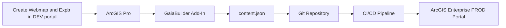
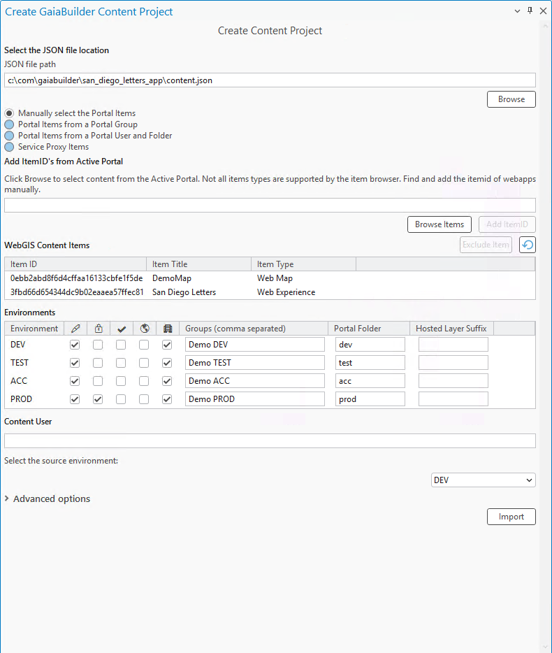

# Publishing an Experience Builder App

This guide builds on the steps described in [Publishing a Map Service](../Publishing%20a%20map%20service/README.md). This means there is already a webmap published in Portal.

In this section, you'll learn how to publish an Experience Builder app using your previously published map service.

## Prerequisites

### 🧠 Assumptions

You should be familiar with:

- Completing the steps outlined in [Publishing a Map Service](../Publishing%20a%20map%20service/README.md), as this guide builds upon that.
- Creating an Experience Builder app based on a template and configuring data sources.
- Managing deployments through JSON configurations using GaiaBuilder.
- Using version control systems such as Git, Subversion, or Bitbucket.

Before starting, ensure you have:

- Access to ArcGIS Enterprise Portal with Experience Builder enabled, or a standalone developer edition of Experience Builder as described [here](https://developers.arcgis.com/experience-builder/guide/install-guide/).

### Overview


# ✅ Step-by-Step Deployment Flow

### Step 1: Create the Experience Builder App

1. Log in to ArcGIS Enterprise Portal and create a new experience. For this example a Fullscreen fixed template based on the 'Foldable' template was used.
2. In our case we have verified our previously published map service is added as a data source and configured correctly.
3. Configure the Portal item Set:
* 🔖 Thumbnail
* 📄 Metadata
* 📜 Terms of use
* 👥 Group permissions
* 🏷️ Tags and categories

### Step 2: Export Your Experience Builder App Configuration

1. Use the GaiaBuilder Add-In to export your Experience Builder app configuration as JSON, including all related resources.


<details><summary>Example GaiaBuilder Content Project Configuration</summary>



</details>

### Step 3: Adjust Configuration for Environment-Specific URL or Title Rewrites

1. Open the `Content.json` configuration file in a text editor of your choice and inspect the rewrite rules applicable to the current deployment environment.

<details><summary>Example Content.json Configuration</summary>

```json
{
    "action": "deployContent",
    "contentSelect": 1,
    "sourcePortal": "https://demo.gaiabuilder.com/portal/",
    "sourceUser": "demo.professional",
    "contentUser": "demo.professional.plus",
    "items": [
        {
            "type": "Web Map",
            "title": "DemoMap",
            "itemId": "0ebb2abd8f6d4cffaa16133cbfe1f5de",
            "rewrites": {
                "environmentRewrite": "--DEV--",
                "webUrl": "https://demo.gaiabuilder.com/server/rest/services/DEV"
            }
        },
        {
            "type": "Web Experience",
            "title": "San Diego Letters",
            "itemId": "3fbd66d654344dc9b02eaaea57ffec81",
            "rewrites": {
                "environmentRewrite": "--DEV--",
                "webUrl": "https://demo.gaiabuilder.com/server/rest/services/DEV"
            }
        }
    ],
    "servers": {
        "DEV": {
            "rewrites": {
                "environmentRewrite": "--DEV--",
                "webUrl": "https://demo.gaiabuilder.com/server/rest/services/DEV"
            },
            "portalFolder": "dev",
            "sharing": {
                "esriEveryone": "false",
                "organization": "true",
                "groups": ["Demo DEV"]
            }
        },
        "TEST": {
            "rewrites": {
                "environmentRewrite": "--TEST--",
                "webUrl": "https://demo.gaiabuilder.com/server/rest/services/TEST"
            },
            "portalFolder": "test",
            "sharing": {
                "esriEveryone": "false",
                "organization": "true",
                "groups": ["Demo TEST"]
            }
        },
        "ACC": {
            "rewrites": {
                "environmentRewrite": "--ACC--",
                "webUrl": "https://demo.gaiabuilder.com/server/rest/services/ACC"
            },
            "portalFolder": "acc",
            "sharing": {
                "esriEveryone": "false",
                "organization": "true",
                "groups": ["Demo ACC"]
            }
        },
        "PROD": {
            "protected": "true",
            "rewrites": {
                "environmentRewrite": "",
                "webUrl": "https://demo.gaiabuilder.com/server/rest/services/PROD"
            },
            "portalFolder": "prod",
            "content_status": "authoritative",
            "sharing": {
                "esriEveryone": "false",
                "organization": "true",
                "groups": ["Demo PROD"]
            }
        }
    }
}
```

</details>

### Step 4: Configure Content Metadata for Export

1. Update the exported JSON configuration to match your target environment (DEV, TEST, ACC, PROD).
2. Adjust URLs, item IDs, and environment-specific settings as needed.


### Step 5: Commit and Push to Version Control

Store the JSON files in Git (or another VCS) for reproducible deployments and rollback support.

<details><summary>Example Files Stored in Git</summary>

📂 **Files stored in Git:**

- 📄 **Web Map (`0ebb2abd8f6d4cffaa16133cbfe1f5de`)**
    - 📑 `0ebb2abd8f6d4cffaa16133cbfe1f5de.data.json`
    - 📑 `0ebb2abd8f6d4cffaa16133cbfe1f5de.json`
    - 📑 `0ebb2abd8f6d4cffaa16133cbfe1f5de.relations.json`
    - 📑 `0ebb2abd8f6d4cffaa16133cbfe1f5de.resources.json`
    - 🖼️ `0ebb2abd8f6d4cffaa16133cbfe1f5de._7B3C97DAD0-4456-4B30-9FED-39CA1275830F_7D.png`

- 📄 **Web Experience (`3fbd66d654344dc9b02eaaea57ffec81`)**
    - 📑 `3fbd66d654344dc9b02eaaea57ffec81.data.json`
    - 📑 `3fbd66d654344dc9b02eaaea57ffec81.json`
    - 📑 `3fbd66d654344dc9b02eaaea57ffec81.relations.json`
    - 📑 `3fbd66d654344dc9b02eaaea57ffec81.resources.json`
    - 📂 **resources/config**
        - ⚙️ `config.json`

- ⚙️ **General Configuration**
    - 📑 `content.json`

- 📂 **Logs**
    - 📜 `installcontent.log`

</details>

### Step 6: Integrate into Your CI/CD System

You can run GaiaBuilder in automation environments such as:

- GitHub Actions
- GitLab CI
- Jenkins
- Azure DevOps
- TeamCity
- Cron-based scripts

---

## 🧪 Generic Deployment Script (PowerShell)

This example works on any runner or agent supporting PowerShell and Python (with Conda):

```powershell
& "$env:CondaHook"
conda activate "$env:CondaEnv_GaiaBuilder"

$scriptPath = "C:\GaiaBuilder\InstallContent_lite.py"

$args = @(
    "-f", $env:manual_build_list,   # JSON config file
    "-s", $env:server               # Server config name
)

python $scriptPath $args
```

### 🔐 Environment Variables

Avoid using `-u` and `-p` arguments directly in CI environments. Instead, securely set these values using your CI/CD environment's secret store:

```yaml
env:
    USER: $(USER)
    PASSWORD: $(PASSWORD)
```

---

## 🧾 GaiaBuilder CLI Options

Detailed documentation for `InstallContent_lite` and its command-line options is available [here](https://github.com/merkator-software/GaiaBuilder-manual/wiki/InstallContentTool).

---

After deployment, verify your map service in the ArcGIS REST Services Directory or ArcGIS Pro Catalog before promoting to higher environments.
