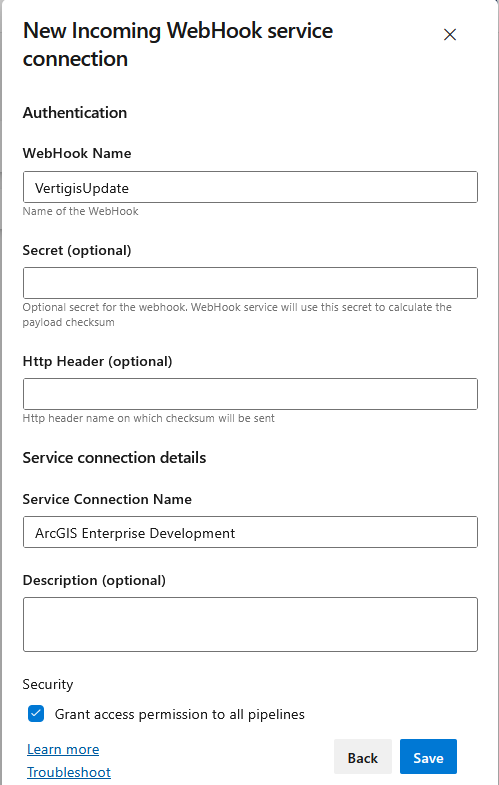
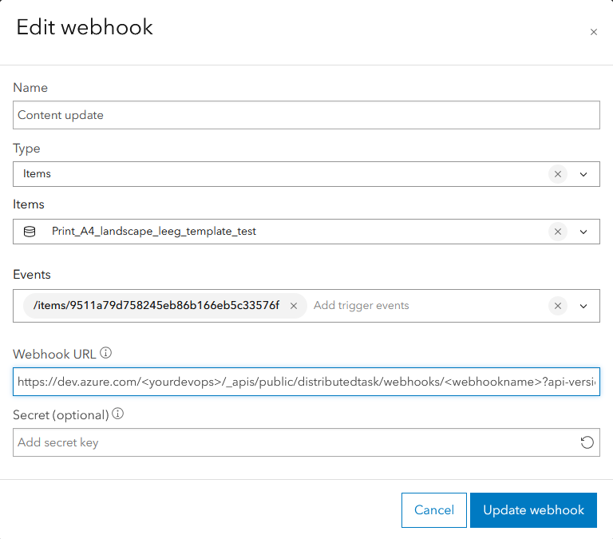

# Trigger a Devops Pipeline from a Webhook o
=====================

### 🧠 Assumptions

You are an Azure Devops user with administrative privileges:

* Configure Service connections
* Configure Repo security

You are an ArcGIS Enterprise user with administrative privileges:

* Manage webhooks

---

### ✅ Step-by-Step Configuration

1. **Create the Devops Service connection**
- Set the webhook name
- Set the service connection name
- Grant access to the pipelines


2. **Create the Devops Pipeline**
   This pipeline will download the JSON data from the Vertigis Server and save it to the GIT. 
   Connect your pipeline to the service connection by specifying the webhook in resources
````yaml
resources:
  webhooks:
    - webhook: VertigisUpdate
      connection: ArcGIS Enterprise Development
````
   The pipeline has 4 main steps: 
   - Do a self checkout on the GIT repo 
   - Configure the GIT info username and email
   - Run the GaiaBuilder ConnectVertigis.py script
   - Commit and push the changes to the repo
   **Make sure you add installcontent.log to the .gitignore to prevent an endless commit-trigger loop**
   **Make sure the pipeline has privileges to push to the remote**

<Details><Summary>Example pipeline configuration for updating on the pipeline for Azure Devops</Summary>
````yaml

trigger:
- none

resources:
  webhooks:
    - webhook: VertigisUpdate
      connection: ArcGIS Enterprise Development

stages:
- stage: 'Download_Vertigis'
  jobs:
  - job: 'Download'
    pool:
      name: 'ArcgisBaseDeployment'

    steps:
    - checkout: self
      persistCredentials: true
    - task: PowerShell@2
      name: GitConfig
      inputs:
        targetType: 'inline'
        script: |
          git config --global user.email "pipeline@dev.azure.com"
          git config --global user.name "Azure DevOps Pipeline"
    - task: PythonScript@0
      inputs:
        scriptSource: 'filePath'
        scriptPath: 'C:/GaiaBuilder/GaiaBuilderServerTools/ConnectVertigis.py'
        arguments: '-f testcase-vertigis-print\content.json -s DEV'
        pythonInterpreter: 'C:\Program Files\ArcGIS\Server\framework\runtime\ArcGIS\bin\Python\envs\arcgis242\python.exe'
      env:
        USER : $(username)
        PASSWORD: $(password)
    - task: PowerShell@2
      name: Gitcommit
      inputs:
        targetType: 'inline'
        script: |
          git add -A
          git commit -m "Update from pipeline"
          git push origin HEAD:develop
````
</Details>

3. **Create the webhook**
- Open your portal and go to the organization settings and select webhooks
- Create a new webhook:
    - Name: Your webhook name in Portal, it could be a good idea to keep this the same to the Webhook name in Devops, when needed combined with the name of the item
    - Type: Items
    - Items: Select one item to trigger the webhook on, it is not adviced to select all items because it will make the devops run frequently without any useful updates
    - Event: Select the update trigger event or all events
    - Webhook URL: Specify the Devops URL, you need to insert your Devops organization name in the URL and the webhookname in the URL, see the placeholders in the example below
<Details><Summary>Example webhook configuration</Summary>

</Details>