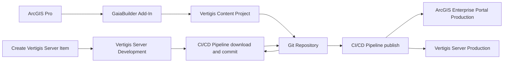
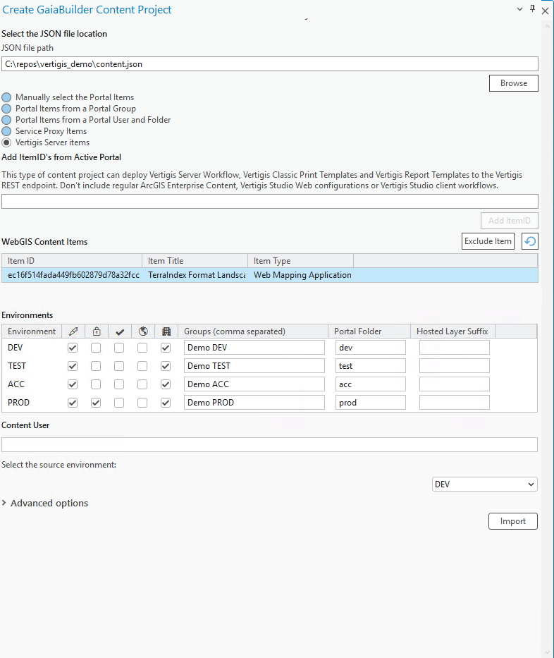

Manage Vertigis Server items
============================

### 🧠 Assumptions

You are an ArcGIS Pro user who knows how to:

* Manage Vertigis Server content
* Configure thumbnails, metadata, terms of use, and group sharing
* High level knowledge of GaiaBuilder to manage deployments through JSON
* Use version control systems like Git, Subversion or Bitbucket

---
###
Vertigis software stores Vertigis Workflow items, Report template items and Legacy Print Template items on their own software installation instead of the Portal. GaiaBuilder has the deployVertigis content type project available to work with these server items. You'll need the ClientID from the Vertigis Oauth registration on Portal for communication with the Vertigis Server. You'll need a pipeline for deployment and another pipeline for downloading the Vertigis Server content to the GIT repo. 


---
### Overview



### Prepare the build server
Add the Vertigis Clientid from the Vertigis application in Portal to GaiaBuilder.ini for each environment. You need to have the same clientid from the Portal configured on Vertigis Server Workflow, Vertigis Print and Vertigis Reporting.
```json
clientid = <clientid>
```

### ✅ Step-by-Step Deployment Flow

1. **Create a Vertigis Server item**
    Create a Vertigis Server workflow, Vertigis Report template or Vertigis Lecacy Print template. A Vertigis Studio Web item, Client workflow or a print template for the new Vertigis Print engine are stored in Portal for ArcGIS and not on the Vertigis Server and cannot be used here

2. **Configure the Portal item**
   
   Set:
   * 🔖 Thumbnail
   * 📄 Title
   * 🔗 Description
   * 🏷️ Summary
   * ©️  Attribution
   * 📜 Terms of use
   * 🏷️ Tags and categories

3. **Create the content project**


- 📁 **Set the location** for the `content.json` inside a Git-initialized or cloned folder.  
- 🔖 **Set the type** of the content project to Vertigis Server items
- 🆔 **Add the required item IDs** — in our example, we manually select the Template `itemId` .  
- ✅ **Verify** that Template is successfully listed in the overview.  
- 💡 **Environments** In our example, we did not uncheck the **Dev** environment, this can be amended by removing the `DEV` section under servers in a text editor,  (see [Environments field reference](../../docs/Environments.md)), and then check that permissions, locks, and folder structure are set as needed for your deployment scenario.
- 🌍 **Select** **DEV** as the source environment.

<details>
<summary>Example GaiaBuilder Content Project Configuration</summary>



</details>

4. **Commit and push to version control**
   Store the JSON files in Git (or other VCS) for reproducible deployments and rollback support.

   <Details><Summary>List of the files stored in git on our environment</Summary>

   * `ec16f514fada449fb602879d78a32f77.json`
   * `ec16f514fada449fb602879d78a32f77.data.json`
   * `ec16f514fada449fb602879d78a32f77.resources.json`
   * `ec16f514fada449fb602879d78a32f77.relations.json`
   * `thumbnail.PNG`
   * `content.json`
</Details>

5. **Create Vertigis Download & Restore pipeline based on GIT trigger**
   This pipeline will download the JSON data from the Vertigis Server and save it to the GIT. In this example the pipeline is configured to trigger on the develop branch. This means that when you commit from your own system the Portal part of the content, the pipeline will automatically run and update the Vertigis part of the content.action
   As an alternative, you can consider configuring a webhook on Portal for ArcGIS which will trigger the pipeline. An example step-bystep configuration is available on [Webhook pipeline trigger configuration](./Webhook pipeline trigger configuration/README.md)
   The pipeline has 4 main steps: 
   - Do a self checkout on the GIT repo 
   - Configure the GIT info username and email
   - Run the GaiaBuilder ConnectVertigis.py script
   - Commit and push the changes to the repo
   **Make sure you add installcontent.log to the .gitignore to prevent an endless commit-trigger loop**
   **Make sure the pipeline has privileges to push to the remote**

Example pipeline configuration for updating on the pipeline for Azure Devops
```yaml
trigger:
- develop #set this to your branch name or to none if you only want to run this automatically
stages:
- stage: 'Download_Vertigis'
  jobs:
  - job: 'Download'
    pool:
      name: 'ArcgisBaseDeployment'
    steps:
    - checkout: self
      persistCredentials: true
    - task: PowerShell@2
      name: GitConfig
      inputs:
        targetType: 'inline'
        script: |
          git config --global user.email "pipeline@dev.azure.com"
          git config --global user.name "Azure DevOps Pipeline"
    - task: PythonScript@0
      inputs:
        scriptSource: 'filePath'
        scriptPath: 'C:/GaiaBuilder/GaiaBuilderServerTools/ConnectVertigis.py'
        arguments: '-f testcase-vertigis-print\content.json -s DEV -a $(action)' #-a is a pipeline variable with default value download, when manuallu running, you can set it to restore
        pythonInterpreter: 'C:\Program Files\ArcGIS\Server\framework\runtime\ArcGIS\bin\Python\envs\arcgis242\python.exe'
      env:
        USER : $(username)
        PASSWORD: $(password)
    - task: PythonScript@0
      inputs:
        scriptSource: 'filePath'
        scriptPath: 'C:/GaiaBuilder/GaiaBuilderServerTools/ConnectVertigis.py'
        arguments: '-f testcase-vertigis-report\content.json -s DEV -a $(action)' #-a is a pipeline variable with default value download, when manuallu running, you can set it to restore
        pythonInterpreter: 'C:\Program Files\ArcGIS\Server\framework\runtime\ArcGIS\bin\Python\envs\arcgis242\python.exe'
      env:
        USER : $(username)
        PASSWORD: $(password)
    - task: PythonScript@0
      inputs:
        scriptSource: 'filePath'
        scriptPath: 'C:/GaiaBuilder/GaiaBuilderServerTools/ConnectVertigis.py'
        arguments: '-f testcase-vertigis-workflow\content.json -s DEV -a $(action)' #-a is a pipeline variable with default value download, when manuallu running, you can set it to restore
        pythonInterpreter: 'C:\Program Files\ArcGIS\Server\framework\runtime\ArcGIS\bin\Python\envs\arcgis242\python.exe'
      env:
        USER : $(username)
        PASSWORD: $(password)
    - task: PowerShell@2
      name: Gitcommit
      inputs:
        targetType: 'inline'
        script: |
          git add -A
          git commit -m "Update from pipeline"
          git push origin HEAD:develop
```


6. **Integrate into your CI/CD system**
    See See [Publishing an Experience Builder App](../Publishing an experience builder app/README.md) for details on configuring the deployment pipeline for deploying this content project to the other stages in your environment.
    You can run GaiaBuilder in any automation environment:

* GitHub Actions
* GitLab CI
* Jenkins
* Azure DevOps
* TeamCity
* Cron-based scripts

---

## 🧪 Generic Deployment Script (PowerShell)

This example works on any runner or agent that supports PowerShell and Python (with Conda) [^1]:

```powershell
& "$env:CondaHook"
conda activate "$env:CondaEnv_GaiaBuilder"

$scriptPath = "C:\GaiaBuilder\ConnectVertigis.py"

$args = @(
  "-f", $env:manual_build_list,   # Required: Relative path to the JSON config file (MapService definition)
  "-s", $env:server,              # Required: Server config name from JSON / global INI
  "-a", "true",                   # Optional (default download): download / restore the Vertigis items
)

python $scriptPath $args
```

### 🔐 Environment Variables
The -u and -p arguments are not safe to use in most CI environments and are intended for standalone use only.
Instead, set these values securely using your CI/CD environment's secret store. As of version 3.11, you can use either `USER` and `PASSWORD` or an `API_KEY` for authentication, depending on your needs. See [Security Best Practices](../../docs/Security-Best-Practices.md) for details.
```yaml
env:
  USER: $(USER)
  PASSWORD: $(PASSWORD)
```

This ensures your credentials do not appear in logs or version control.

**API_KEY is not supported on this workflow**

[^1]: ## 🧾 GaiaBuilder CLI Options
InstallGeoProcessorTool and the light version (without an arcpy dependency) command line options are documented [here](https://github.com/merkator-software/GaiaBuilder-manual/wiki/InstallGeoProcessorTool)


