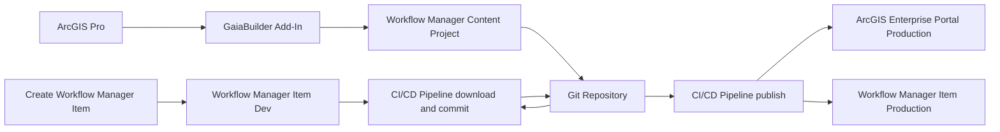
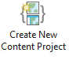
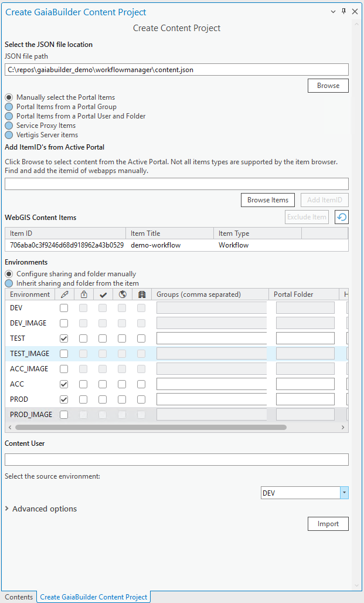

Manage Workflow Manager Items
============================

### 🧠 Assumptions

You are an ArcGIS Pro user who knows how to:

* Manage Workflow Manager Items
* Configure thumbnails, metadata, terms of use, and group sharing
* High level knowledge of GaiaBuilder to manage deployments through JSON
* Use version control systems like Git, Subversion or Bitbucket

---
###
Workflow Manager Items stores the configuration of workflows inside a hosted Featureservice and makes this data available with two hosted view layers. GaiaBuilder has the deployWorkflowManagerConfig content type project available to work with Workflow Manager items and configurations. You'll need a pipeline for deployment and another pipeline for downloading the Workflow Manager items to the GIT repo. GaiaBuilder uses the Esri export format for Workflow Manager Items to run the export from Portal and import into Portal and applies the necessary logic to apply version control to these configurations and it updates these configurations with new urls, itemids and groupids when the Workflow configuration is published to the next stage. After a succesfull deployment the sourceitemid and targetitemid of this Workflow item, the related Hosted Featureservice and View Services and the old and new groupid are registered to the GaiaBuilderItemRegistry. 

---
### Overview


### ✅ Step-by-Step Deployment Flow

1. **Create a Workflow Manager item**
    Create and configure the Workflow Manager Item in your Portal using the Workflow Manager application

2. **Configure the Portal item**
   
   Set:
   * 🔖 Thumbnail
   * 📄 Title
   * 🔗 Description
   * 🏷️ Summary
   * ©️  Attribution
   * 📜 Terms of use
   * 🏷️ Tags and categories

3. **Create the content project**


- 📁 **Set the location** for the `content.json` inside a Git-initialized or cloned folder.  
- 🔖 **Set the type** of the content project to Manually select the Portal Items
- 🆔 **Add the required item IDs** — in our example, we manually select the Workflow Item `itemId` . Ignore all the related Hosted Featureservice items or Hosted View Featureservice items related to this Workflow
- ✅ **Verify** that Workflow Item is successfully listed in the overview.  
- 💡 **Environments** Uncheck the **Dev** environment, and then check that permissions, locks, and folder structure are set as needed for your deployment scenario. With this first release, these settings will be ignored. Be aware that the Workflow Manager will create a new group for each Workflow Item and applies the sharing from there. 
- 🌍 **Select** **DEV** as the source environment.

<details>
<summary>Example GaiaBuilder Content Project Configuration</summary>



</details>

4. **Modify content.json file and .gitignore file**
Open the content.json file in a text editor.
Change the propery value on action:
`  "action": "deployContent",` -> `  "action": "deployWorkflowManagerConfig",`
Open .gitignore and make sure you add these lines are there to ignore logfiles and wmc files:
`*.wmc`
`*.log`

5. **Commit and push to version control**
   Store the JSON files in Git (or other VCS) for reproducible deployments and rollback support.

   <Details><Summary>List of the files stored in git on our environment</Summary>

   * `706aba0c3f9246d68d918962a43b0529.json`
   * `706aba0c3f9246d68d918962a43b0529.data.json`
   * `706aba0c3f9246d68d918962a43b0529.resources.json`
   * `706aba0c3f9246d68d918962a43b0529.relations.json`
   * `content.json`
</Details>

6. **Create Workflow Manager Export from Portal pipeline**
   This pipeline will download the Workflow Manager configuration and save it to JSON in GIT. The pipeline is set to a manual run, because it will commit itself to the repo and setting a trigger is likely to cause and endless loop. When the pipeline runs it will export the workflow configuration from Workflow Manager and update the Workflow Manager Config in GIT.
   The pipeline has 4 main steps: 
   - Do a self checkout on the GIT repo 
   - Configure the GIT info username and email
   - Run the GaiaBuilder WorkflowManager.py script
   - Commit and push the changes to the repo
   **Make sure you add installcontent.log to the .gitignore to prevent an endless commit-trigger loop**
   **Make sure the pipeline has privileges to push to the remote**
   **Make sure the Portal user has adminAdvanced privilege**

Example pipeline configuration for updating on the pipeline for Azure Devops
```yaml
trigger:
- none
stages:
- stage: 'Download_WorkflowManager'
  jobs:
  - job: 'Download'
    pool:
      name: 'ArcgisBaseDeployment' #update this to the name of your Azure Devops Pool
    steps:
    - checkout: self
      persistCredentials: true
    - task: PowerShell@2
      name: GitConfig
      inputs:
        targetType: 'inline' #update this script to have the right username and email for your process
        script: |
          git config --global user.email "pipeline@dev.azure.com"  
          git config --global user.name "Azure DevOps Pipeline"
    - task: PythonScript@0
      inputs:
        scriptSource: 'filePath'
        scriptPath: 'C:/GaiaBuilder/GaiaBuilderServerTools/WorkflowManager.py' #update this to your GaiaBuilder path on the build server
        arguments: '-f Configuration_examples\Workflow Manager Items\content.json -s DEV -a export' #update the  -f parameter to the relative path of the content.json file in this repo
        pythonInterpreter: 'C:\Program Files\ArcGIS\Server\framework\runtime\ArcGIS\bin\Python\envs\arcgis242\python.exe' #update this to your Python install path on the build server
      env:
        USER : $(username)
        PASSWORD: $(password)
        
    - task: PowerShell@2
      name: Gitcommit
      inputs:
        targetType: 'inline'
        script: |
          git add -A
          git commit -m "Update from pipeline"
          git push origin HEAD:develop
```


7. **Integrate into your CI/CD system**
    See See [Publishing an Experience Builder App](../Publishing an experience builder app/README.md) for details on configuring the deployment pipeline for deploying this content project to the other stages in your environment.
    You can run GaiaBuilder in any automation environment:

* GitHub Actions
* GitLab CI
* Jenkins
* Azure DevOps
* TeamCity
* Cron-based scripts

---

## 🧪 Deployment Script (PowerShell)

This example works on any runner or agent that supports PowerShell and Python (with Conda):


**Make sure the Portal user has adminAdvanced privilege**

```powershell
& "$env:CondaHook"
conda activate "$env:CondaEnv_GaiaBuilder"

$scriptPath = "C:\GaiaBuilder\WorkflowManager.py"

$args = @(
  "-f", $env:manual_build_list,   # Required: Relative path to the JSON config file (MapService definition)
  "-s", $env:server,              # Required: Server config name from JSON / global INI
  "-a", "import",                   # Required: import
)

python $scriptPath $args
```

### 🔐 Environment Variables
The -u and -p arguments are not safe to use in most CI environments and are intended for standalone use only.
Instead, set these values securely using your CI/CD environment's secret store. As of version 3.11, you can use either `USER` and `PASSWORD` or an `API_KEY` for authentication, depending on your needs. See [Security Best Practices](../../docs/Security-Best-Practices.md) for details.
```yaml
env:
  USER: $(USER)
  PASSWORD: $(PASSWORD)
```

This ensures your credentials do not appear in logs or version control.


