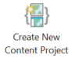

# 🌍 GaiaBuilder Environments – Field Reference

This document describes the Environments table with the Field Path mapping to the `content.json` project file. This table is part of the Create New Content Project workflow.



---

## 📋 Table – Column Descriptions

| Icon / Label                      | Field Path                          | Description                                                                                 |
| --------------------------------- | ----------------------------------- | ------------------------------------------------------------------------------------------- |
| *(none)* **Environment**          | —                                   | Logical name for the environment (e.g., DEV, TEST). Used across all configuration blocks.   |
| ✏️ **Pencil**                     | `servers[ENV]`                      | This item is added under the `servers` section.            |
| 🔒 **Lock**                       | `servers[ENV].protected`            | Reflects the *"Prevent this item from being accidentally deleted"* setting in ArcGIS Server.|
| ✅ **Authoritative**              | `servers[ENV].content_status`       | Sets metadata for the item, such as `authoritative`, in the portal catalog.                 |
| 🌍 **Globe**                      | `servers[ENV].sharing.esriEveryone` | Controls whether the content is shared publicly with everyone.                              |
| 🏢 **Organisation**               | `servers[ENV].sharing.organisation` | Toggles sharing with the ArcGIS organisation.                                               |
| *(none)* **Groups**               | `servers[ENV].sharing.groups[]`     | Comma-separated list of group names for access control. A context item can be shared with multiple groups.                                    |
| *(none)* **Portal Folder**        | `servers[ENV].portalFolder`         | Destination folder in ArcGIS Portal for storing deployed items.                             |
| *(none)* **Hosted Layer Suffix**  | `servers[ENV].layersuffix`          | Optional suffix appended to hosted layer names during deployment. Usefull for distinguishing test vs. prod layers                           |

---

<Details><Summary>
Example content.json server section output
</Summary>

```json
{
  ...
  "servers": {
    "TEST": {
      "protected": "false",
      "rewrites": {},
      "portalLogo": null,
      "portalFolder": "test",
      "content_status": null,
      "sharing": {
        "esriEveryone": "false",
        "organization": "false",
        "groups": [
          "Demo TEST"
        ]
      },
      "layersuffix": ""
    },
    "ACC": {
      "protected": "false",
      "rewrites": {},
      "portalLogo": null,
      "portalFolder": "acc",
      "content_status": null,
      "sharing": {
        "esriEveryone": "false",
        "organization": "false",
        "groups": [
          "Demo ACC"
        ]
      },
      "layersuffix": ""
    },
    "PROD": {
      "protected": "true",
      "rewrites": {},
      "portalLogo": null,
      "portalFolder": "prod",
      "content_status": "authoritative",
      "sharing": {
        "esriEveryone": "false",
        "organization": "true",
        "groups": [
          "Demo PROD"
        ]
      },
      "layersuffix": ""
    }
  }
}
```
</Details>

## 🧭 Usage Guidelines

- You usualy want to disable the environment which is the source during content selection E.G. DEV.
- You can always configure the `servers` sections later, amend using your prefered text editor. 
- Best practice in the virtual DTAP environment is to use consistent folder names and/or suffixes across environments to simplify item tracing.


